# SimpleTrust Consolidated Data Model

This document consolidates the data models from all feature specifications into a comprehensive data model for the SimpleTrust platform.

## Core Entities

### Organization and Business Context

#### Organizations
- `id`: uuid (primary key)
- `name`: string
- `industry`: string
- `size`: string
- `region`: string
- `created_at`: timestamp
- `updated_at`: timestamp

#### BusinessCapabilities
- `id`: uuid (primary key)
- `organization_id`: uuid (foreign key)
- `name`: string
- `description`: text
- `capability_type`: enum [core, supporting, management]
- `criticality`: enum [low, medium, high, critical]
- `parent_id`: uuid (self-reference, nullable)
- `owner_id`: uuid (foreign key to Users, nullable)
- `created_at`: timestamp
- `updated_at`: timestamp

#### CapabilityAttributes
- `id`: uuid (primary key)
- `capability_id`: uuid (foreign key)
- `attribute_name`: string
- `attribute_value`: text
- `created_at`: timestamp
- `updated_at`: timestamp

#### ComplianceDomains
- `id`: uuid (primary key)
- `name`: string
- `description`: text
- `regulatory_area`: string
- `created_at`: timestamp
- `updated_at`: timestamp

#### CapabilityComplianceMapping
- `id`: uuid (primary key)
- `capability_id`: uuid (foreign key)
- `compliance_domain_id`: uuid (foreign key)
- `impact_level`: enum [low, medium, high]
- `notes`: text
- `created_at`: timestamp
- `updated_at`: timestamp

#### CapabilityVersions
- `id`: uuid (primary key)
- `capability_id`: uuid (foreign key)
- `version_number`: integer
- `changes`: jsonb
- `changed_by`: uuid (foreign key to Users)
- `created_at`: timestamp

#### CapabilityTemplates
- `id`: uuid (primary key)
- `name`: string
- `industry`: string
- `description`: text
- `capabilities`: jsonb
- `created_at`: timestamp
- `updated_at`: timestamp

#### RegulatoryScope
- `id`: uuid (primary key)
- `organization_id`: uuid (foreign key)
- `regulation_id`: uuid (foreign key)
- `applicable`: boolean
- `relevance_score`: float
- `created_at`: timestamp
- `updated_at`: timestamp

#### Regulations
- `id`: uuid (primary key)
- `code`: string
- `name`: string
- `description`: text
- `region`: string
- `industry`: string[]
- `created_at`: timestamp
- `updated_at`: timestamp

#### IndustryTemplates
- `id`: uuid (primary key)
- `name`: string
- `industry`: string
- `description`: text
- `capabilities`: jsonb
- `regulations`: jsonb
- `created_at`: timestamp
- `updated_at`: timestamp

### Unified Control Framework

#### ControlFramework
- `id`: uuid (primary key)
- `name`: string
- `description`: text
- `version`: string
- `source`: string
- `publication_date`: date
- `is_active`: boolean
- `is_custom`: boolean
- `metadata`: jsonb
- `created_at`: timestamp
- `updated_at`: timestamp
- `created_by`: uuid (foreign key to Users)

#### Control
- `id`: uuid (primary key)
- `framework_id`: uuid (foreign key to ControlFramework)
- `control_id`: string
- `title`: string
- `description`: text
- `objective`: text
- `parent_id`: uuid (foreign key to Control, nullable)
- `level`: integer
- `type`: enum [preventive, detective, corrective, etc.]
- `category`: string
- `implementation_guidance`: text
- `testing_procedures`: text
- `evidence_requirements`: text
- `is_active`: boolean
- `criticality`: enum [high, medium, low]
- `version`: integer
- `created_at`: timestamp
- `updated_at`: timestamp
- `created_by`: uuid (foreign key to Users)
- `last_modified_by`: uuid (foreign key to Users)

#### ControlTag
- `id`: uuid (primary key)
- `name`: string
- `description`: string
- `category`: string
- `color`: string
- `created_at`: timestamp
- `created_by`: uuid (foreign key to Users)

#### ControlTagAssignment
- `id`: uuid (primary key)
- `control_id`: uuid (foreign key to Control)
- `tag_id`: uuid (foreign key to ControlTag)
- `created_at`: timestamp
- `created_by`: uuid (foreign key to Users)

#### ControlRelationship
- `id`: uuid (primary key)
- `source_control_id`: uuid (foreign key to Control)
- `target_control_id`: uuid (foreign key to Control)
- `relationship_type`: enum [parent-child, related, depends-on, etc.]
- `description`: text
- `created_at`: timestamp
- `created_by`: uuid (foreign key to Users)

#### ControlVersion
- `id`: uuid (primary key)
- `control_id`: uuid (foreign key to Control)
- `version_number`: integer
- `changes`: text
- `control_data`: jsonb
- `created_at`: timestamp
- `created_by`: uuid (foreign key to Users)

#### ControlResponsibility
- `id`: uuid (primary key)
- `control_id`: uuid (foreign key to Control)
- `entity_type`: enum [role, team, department, individual]
- `entity_id`: string
- `responsibility_type`: enum [accountable, responsible, consulted, informed]
- `notes`: text
- `created_at`: timestamp

### Asset Management

#### Assets
- `id`: uuid (primary key)
- `organization_id`: uuid (foreign key to Organizations)
- `name`: string
- `description`: text
- `asset_type`: enum [hardware, software, data, service, facility, personnel]
- `status`: enum [active, inactive, retired, planned]
- `identifier`: string (optional, external ID)
- `acquisition_date`: date (optional)
- `retirement_date`: date (optional)
- `owner_id`: uuid (foreign key to Users, nullable)
- `custodian_id`: uuid (foreign key to Users, nullable)
- `location`: string (optional)
- `vendor`: string (optional)
- `created_at`: timestamp
- `updated_at`: timestamp

#### AssetCategories
- `id`: uuid (primary key)
- `organization_id`: uuid (foreign key to Organizations)
- `name`: string
- `description`: text
- `parent_id`: uuid (self-reference, nullable)
- `created_at`: timestamp
- `updated_at`: timestamp

#### AssetCategoryAssignments
- `id`: uuid (primary key)
- `asset_id`: uuid (foreign key to Assets)
- `category_id`: uuid (foreign key to AssetCategories)
- `created_at`: timestamp

#### AssetTags
- `id`: uuid (primary key)
- `organization_id`: uuid (foreign key to Organizations)
- `name`: string
- `description`: text (optional)
- `created_at`: timestamp
- `updated_at`: timestamp

#### AssetTagAssignments
- `id`: uuid (primary key)
- `asset_id`: uuid (foreign key to Assets)
- `tag_id`: uuid (foreign key to AssetTags)
- `created_at`: timestamp

#### AssetAttributes
- `id`: uuid (primary key)
- `asset_id`: uuid (foreign key to Assets)
- `attribute_name`: string
- `attribute_value`: text
- `created_at`: timestamp
- `updated_at`: timestamp

#### AssetRelationships
- `id`: uuid (primary key)
- `source_asset_id`: uuid (foreign key to Assets)
- `target_asset_id`: uuid (foreign key to Assets)
- `relationship_type`: enum [contains, depends_on, connects_to, processes, hosts, etc.]
- `description`: text (optional)
- `created_at`: timestamp
- `updated_at`: timestamp

#### AssetChangeHistory
- `id`: uuid (primary key)
- `asset_id`: uuid (foreign key to Assets)
- `changed_by`: uuid (foreign key to Users)
- `change_type`: enum [created, updated, categorized, related, etc.]
- `previous_values`: jsonb (optional)
- `new_values`: jsonb (optional)
- `notes`: text (optional)
- `created_at`: timestamp

#### CapabilityAssetMapping
- `id`: uuid (primary key)
- `capability_id`: uuid (foreign key to BusinessCapabilities)
- `asset_id`: uuid (foreign key to Assets)
- `relationship_type`: enum [supports, enables, depends_on]
- `created_at`: timestamp
- `updated_at`: timestamp

### Assessment and Gap Analysis

#### AssessmentTemplates
- `id`: uuid (primary key)
- `organization_id`: uuid (foreign key)
- `name`: string
- `description`: text
- `version`: string
- `status`: enum [draft, published, archived]
- `framework_ids`: uuid[] (foreign keys to ControlFrameworks)
- `regulatory_requirement_ids`: uuid[] (foreign keys to RegulatoryRequirements, nullable)
- `is_standard`: boolean
- `scoring_type`: enum [binary, weighted, percentage, custom]
- `passing_threshold`: float (nullable)
- `default_language`: string
- `created_by`: uuid (foreign key to Users)
- `created_at`: timestamp
- `updated_at`: timestamp
- `published_at`: timestamp (nullable)

#### TemplateSections
- `id`: uuid (primary key)
- `template_id`: uuid (foreign key to AssessmentTemplates)
- `parent_section_id`: uuid (foreign key to TemplateSections, nullable)
- `name`: string
- `description`: text
- `order_index`: integer
- `weight`: float (for weighted scoring)
- `conditional_display`: jsonb (nullable)
- `created_at`: timestamp
- `updated_at`: timestamp

#### TemplateQuestions
- `id`: uuid (primary key)
- `section_id`: uuid (foreign key to TemplateSections)
- `question_bank_id`: uuid (foreign key to QuestionBank, nullable)
- `question_text`: text
- `question_type`: enum [yes_no, multiple_choice, scale, text, number, date, file, evidence]
- `help_text`: text (nullable)
- `is_required`: boolean
- `order_index`: integer
- `weight`: float (for weighted scoring)
- `configuration`: jsonb
- `conditional_display`: jsonb (nullable)
- `control_ids`: uuid[] (foreign keys to Controls, nullable)
- `regulatory_requirement_ids`: uuid[] (foreign keys to RegulatoryRequirements, nullable)
- `risk_related`: boolean
- `created_at`: timestamp
- `updated_at`: timestamp

#### QuestionOptions
- `id`: uuid (primary key)
- `question_id`: uuid (foreign key to TemplateQuestions)
- `option_text`: text
- `score_value`: float (nullable)
- `is_compliant`: boolean (nullable)
- `order_index`: integer
- `requires_evidence`: boolean
- `requires_justification`: boolean
- `action_trigger`: jsonb (nullable)
- `created_at`: timestamp
- `updated_at`: timestamp

#### QuestionBank
- `id`: uuid (primary key)
- `organization_id`: uuid (foreign key)
- `question_text`: text
- `question_type`: enum [yes_no, multiple_choice, scale, text, number, date, file, evidence]
- `help_text`: text (nullable)
- `category`: string
- `tags`: string[]
- `framework_ids`: uuid[] (foreign keys to ControlFrameworks, nullable)
- `control_ids`: uuid[] (foreign keys to Controls, nullable)
- `regulatory_requirement_ids`: uuid[] (foreign keys to RegulatoryRequirements, nullable)
- `is_standard`: boolean
- `created_by`: uuid (foreign key to Users)
- `created_at`: timestamp
- `updated_at`: timestamp

#### TemplateVersions
- `id`: uuid (primary key)
- `template_id`: uuid (foreign key to AssessmentTemplates)
- `version`: string
- `change_summary`: text
- `template_snapshot`: jsonb
- `created_by`: uuid (foreign key to Users)
- `created_at`: timestamp

#### TemplateTranslations
- `id`: uuid (primary key)
- `template_id`: uuid (foreign key to AssessmentTemplates)
- `language_code`: string
- `translated_name`: string
- `translated_description`: text
- `created_at`: timestamp
- `updated_at`: timestamp

#### QuestionTranslations
- `id`: uuid (primary key)
- `question_id`: uuid (foreign key to TemplateQuestions or QuestionBank)
- `language_code`: string
- `translated_text`: text
- `translated_help_text`: text (nullable)
- `created_at`: timestamp
- `updated_at`: timestamp

#### OptionTranslations
- `id`: uuid (primary key)
- `option_id`: uuid (foreign key to QuestionOptions)
- `language_code`: string
- `translated_text`: text
- `created_at`: timestamp
- `updated_at`: timestamp

#### Assessments
- `id`: uuid (primary key)
- `organization_id`: uuid (foreign key)
- `template_id`: uuid (foreign key to AssessmentTemplates)
- `name`: string
- `description`: text
- `status`: enum [draft, in_progress, in_review, completed, archived]
- `start_date`: date
- `target_completion_date`: date
- `actual_completion_date`: date (nullable)
- `owner_id`: uuid (foreign key to Users)
- `scope_definition`: jsonb (nullable)
- `asset_ids`: uuid[] (foreign keys to Assets, nullable)
- `overall_score`: float (nullable)
- `compliance_level`: enum [compliant, partially_compliant, non_compliant, not_applicable] (nullable)
- `version`: string
- `created_at`: timestamp
- `updated_at`: timestamp

#### AssessmentSections
- `id`: uuid (primary key)
- `assessment_id`: uuid (foreign key to Assessments)
- `template_section_id`: uuid (foreign key to TemplateSections)
- `name`: string
- `description`: text
- `order_index`: integer
- `status`: enum [not_started, in_progress, completed, skipped]
- `completion_percentage`: float
- `section_score`: float (nullable)
- `weight`: float
- `created_at`: timestamp
- `updated_at`: timestamp

#### AssessmentQuestions
- `id`: uuid (primary key)
- `assessment_section_id`: uuid (foreign key to AssessmentSections)
- `template_question_id`: uuid (foreign key to TemplateQuestions)
- `question_text`: text
- `question_type`: enum [yes_no, multiple_choice, scale, text, number, date, file, evidence]
- `help_text`: text (nullable)
- `order_index`: integer
- `is_required`: boolean
- `assigned_to_id`: uuid (foreign key to Users, nullable)
- `assigned_role_id`: uuid (foreign key to Roles, nullable)
- `status`: enum [not_started, in_progress, answered, reviewed, approved, rejected]
- `weight`: float
- `due_date`: date (nullable)
- `created_at`: timestamp
- `updated_at`: timestamp

#### AssessmentResponses
- `id`: uuid (primary key)
- `assessment_question_id`: uuid (foreign key to AssessmentQuestions)
- `response_value`: jsonb
- `selected_option_ids`: uuid[] (nullable)
- `response_score`: float (nullable)
- `compliance_status`: enum [compliant, partially_compliant, non_compliant, not_applicable]
- `response_justification`: text (nullable)
- `answered_by_id`: uuid (foreign key to Users)
- `answered_at`: timestamp
- `last_updated_by_id`: uuid (foreign key to Users)
- `updated_at`: timestamp

#### ResponseEvidences
- `id`: uuid (primary key)
- `response_id`: uuid (foreign key to AssessmentResponses)
- `evidence_id`: uuid (foreign key to Evidences)
- `description`: text
- `created_by_id`: uuid (foreign key to Users)
- `created_at`: timestamp

#### ResponseReviews
- `id`: uuid (primary key)
- `response_id`: uuid (foreign key to AssessmentResponses)
- `reviewer_id`: uuid (foreign key to Users)
- `review_status`: enum [pending, approved, rejected, needs_more_info]
- `review_notes`: text (nullable)
- `reviewed_at`: timestamp

#### ResponseComments
- `id`: uuid (primary key)
- `response_id`: uuid (foreign key to AssessmentResponses)
- `comment_text`: text
- `commenter_id`: uuid (foreign key to Users)
- `created_at`: timestamp
- `updated_at`: timestamp

#### AssessmentHistory
- `id`: uuid (primary key)
- `assessment_id`: uuid (foreign key to Assessments)
- `action_type`: enum [created, updated, status_changed, assigned, submitted, reviewed, completed]
- `action_details`: jsonb
- `performed_by_id`: uuid (foreign key to Users)
- `performed_at`: timestamp

#### AssessmentReports
- `id`: uuid (primary key)
- `assessment_id`: uuid (foreign key to Assessments)
- `report_name`: string
- `report_type`: enum [summary, detailed, executive, scorecard, evidence_inventory]
- `report_format`: enum [pdf, excel, html, json]
- `report_data`: jsonb (nullable)
- `file_path`: string (nullable)
- `generated_by_id`: uuid (foreign key to Users)
- `generated_at`: timestamp
- `expiration_date`: timestamp (nullable)

#### ComplianceGaps
- `id`: uuid (primary key)
- `organization_id`: uuid (foreign key)
- `gap_title`: string
- `gap_description`: text
- `gap_type`: enum [technical, process, documentation, resource, knowledge]
- `severity`: enum [critical, high, medium, low]
- `status`: enum [identified, acknowledged, in_progress, remediated, verified, accepted]
- `source`: enum [assessment, audit, self_identification, automated_scan, third_party]
- `source_reference`: string (nullable)
- `assessment_id`: uuid (foreign key to Assessments, nullable)
- `assessment_question_id`: uuid (foreign key to AssessmentQuestions, nullable)
- `framework_ids`: uuid[] (foreign keys to ControlFrameworks)
- `control_ids`: uuid[] (foreign keys to Controls)
- `regulatory_requirement_ids`: uuid[] (foreign keys to RegulatoryRequirements, nullable)
- `affected_asset_ids`: uuid[] (foreign keys to Assets, nullable)
- `owner_id`: uuid (foreign key to Users, nullable)
- `department_id`: uuid (foreign key to Departments, nullable)
- `identified_date`: date
- `target_remediation_date`: date (nullable)
- `actual_remediation_date`: date (nullable)
- `verified_by_id`: uuid (foreign key to Users, nullable)
- `verification_date`: date (nullable)
- `risk_score`: float (nullable)
- `business_impact`: text (nullable)
- `is_recurring`: boolean
- `recurring_frequency`: string (nullable)
- `created_by_id`: uuid (foreign key to Users)
- `created_at`: timestamp
- `updated_at`: timestamp

#### GapRemediation
- `id`: uuid (primary key)
- `gap_id`: uuid (foreign key to ComplianceGaps)
- `remediation_plan`: text
- `remediation_approach`: enum [mitigate, accept, transfer, avoid]
- `estimated_effort`: enum [minimal, moderate, significant, extensive]
- `estimated_cost`: decimal (nullable)
- `responsible_party_id`: uuid (foreign key to Users)
- `reviewer_id`: uuid (foreign key to Users, nullable)
- `approval_status`: enum [pending, approved, rejected, changes_requested]
- `approval_notes`: text (nullable)
- `approval_date`: date (nullable)
- `created_at`: timestamp
- `updated_at`: timestamp

#### GapEvidence
- `id`: uuid (primary key)
- `gap_id`: uuid (foreign key to ComplianceGaps)
- `evidence_type`: enum [document, screenshot, log, attestation, test_result, configuration]
- `evidence_id`: uuid (foreign key to Evidences)
- `display_name`: string
- `description`: text
- `is_remediation_evidence`: boolean
- `added_by_id`: uuid (foreign key to Users)
- `added_at`: timestamp

#### GapStatusHistory
- `id`: uuid (primary key)
- `gap_id`: uuid (foreign key to ComplianceGaps)
- `previous_status`: enum [identified, acknowledged, in_progress, remediated, verified, accepted]
- `new_status`: enum [identified, acknowledged, in_progress, remediated, verified, accepted]
- `change_reason`: text
- `changed_by_id`: uuid (foreign key to Users)
- `changed_at`: timestamp

#### GapComments
- `id`: uuid (primary key)
- `gap_id`: uuid (foreign key to ComplianceGaps)
- `comment_text`: text
- `commenter_id`: uuid (foreign key to Users)
- `created_at`: timestamp
- `updated_at`: timestamp

#### GapTags
- `id`: uuid (primary key)
- `organization_id`: uuid (foreign key)
- `tag_name`: string
- `tag_description`: text (nullable)
- `color`: string (hex code)
- `created_at`: timestamp
- `updated_at`: timestamp

#### GapTagAssignments
- `id`: uuid (primary key)
- `gap_id`: uuid (foreign key to ComplianceGaps)
- `tag_id`: uuid (foreign key to GapTags)
- `assigned_by_id`: uuid (foreign key to Users)
- `assigned_at`: timestamp

#### GapReports
- `id`: uuid (primary key)
- `organization_id`: uuid (foreign key)
- `report_name`: string
- `report_type`: enum [summary, detailed, executive, framework, department, trend]
- `filter_criteria`: jsonb
- `included_fields`: string[]
- `report_format`: enum [pdf, excel, html, json]
- `created_by_id`: uuid (foreign key to Users)
- `created_at`: timestamp
- `expiration_date`: timestamp (nullable)
- `file_path`: string (nullable)

#### ComplianceScores
- `id`: uuid (primary key)
- `organization_id`: uuid (foreign key)
- `framework_id`: uuid (foreign key to ControlFrameworks, nullable)
- `department_id`: uuid (foreign key to Departments, nullable)
- `calculation_date`: date
- `score_value`: float
- `compliance_level`: enum [compliant, partially_compliant, non_compliant, not_applicable]
- `created_at`: timestamp

### Evidence Management

#### EvidenceItem
- `id`: uuid (primary key)
- `title`: string
- `description`: text
- `file_path`: string
- `file_name`: string
- `file_type`: string
- `file_size`: integer
- `md5_hash`: string
- `upload_date`: timestamp
- `uploaded_by`: uuid (foreign key to Users)
- `last_modified`: timestamp
- `modified_by`: uuid (foreign key to Users)
- `expiration_date`: date (nullable)
- `review_date`: date (nullable)
- `status`: enum [draft, active, archived, expired]
- `version`: integer
- `is_encrypted`: boolean
- `collection_id`: uuid (foreign key to EvidenceCollection, nullable)
- `source`: enum [upload, system, integration]
- `created_at`: timestamp
- `updated_at`: timestamp

#### EvidenceCollection
- `id`: uuid (primary key)
- `name`: string
- `description`: text
- `parent_id`: uuid (foreign key to EvidenceCollection, nullable)
- `created_by`: uuid (foreign key to Users)
- `created_at`: timestamp
- `updated_at`: timestamp
- `path`: string
- `is_system`: boolean

#### EvidenceMetadata
- `id`: uuid (primary key)
- `evidence_id`: uuid (foreign key to EvidenceItem)
- `key`: string
- `value`: string
- `created_at`: timestamp
- `updated_at`: timestamp

#### EvidenceTag
- `id`: uuid (primary key)
- `name`: string
- `description`: text (nullable)
- `color`: string (nullable)
- `created_at`: timestamp
- `updated_at`: timestamp

#### EvidenceTagAssignment
- `id`: uuid (primary key)
- `evidence_id`: uuid (foreign key to EvidenceItem)
- `tag_id`: uuid (foreign key to EvidenceTag)
- `created_by`: uuid (foreign key to Users)
- `created_at`: timestamp

#### EvidenceVersion
- `id`: uuid (primary key)
- `evidence_id`: uuid (foreign key to EvidenceItem)
- `version`: integer
- `file_path`: string
- `file_size`: integer
- `md5_hash`: string
- `created_by`: uuid (foreign key to Users)
- `created_at`: timestamp

## Cross-Entity Relationships

### Control-Evidence Relationships
- Controls are associated with evidence through the evidence metadata or through dedicated mapping tables
- Evidence items can be linked to multiple controls
- Evidence provides proof of control implementation

### Asset-Control Relationships
- Assets are mapped to controls to indicate which controls apply to which assets
- This mapping helps in identifying control coverage across the asset inventory

### Capability-Regulation Relationships
- Business capabilities are mapped to regulations to understand regulatory impact on business functions
- This mapping provides business context for compliance activities

### Asset-Capability Relationships
- Assets are mapped to business capabilities to understand which assets support which business functions
- This mapping helps in prioritizing asset-related compliance activities

### Assessment-Gap Relationships
- Assessment responses that indicate non-compliance can generate compliance gaps
- Gaps can be linked back to the specific assessment questions that identified them

### Evidence-Assessment Relationships
- Evidence items can be attached to assessment responses to demonstrate compliance
- Assessment responses can reference multiple evidence items

## Mermaid Representation

```mermaid
erDiagram
    Organizations ||--o{ BusinessCapabilities : has
    Organizations ||--o{ RegulatoryScope : has
    Organizations ||--o{ Assets : owns
    Organizations ||--o{ AssessmentTemplates : creates
    Organizations ||--o{ Assessments : conducts
    
    BusinessCapabilities ||--o{ CapabilityAttributes : has
    BusinessCapabilities ||--o{ CapabilityVersions : tracks
    BusinessCapabilities }o--o{ Assets : supports
    BusinessCapabilities }o--o{ ComplianceDomains : maps_to
    
    RegulatoryScope }o--|| Regulations : references
    
    ControlFramework ||--o{ Control : contains
    Control ||--o{ ControlVersion : tracks
    Control }o--o{ ControlTag : tagged_with
    Control }o--o{ Control : relates_to
    Control ||--o{ ControlResponsibility : assigns
    
    Assets ||--o{ AssetAttributes : has
    Assets ||--o{ AssetCategoryAssignments : categorized_by
    Assets ||--o{ AssetTagAssignments : tagged_with
    Assets }o--o{ Assets : relates_to
    Assets ||--o{ AssetChangeHistory : tracks
    
    AssetCategoryAssignments }o--|| AssetCategories : references
    AssetTagAssignments }o--|| AssetTags : references
    
    EvidenceItem ||--o{ EvidenceMetadata : has
    EvidenceItem ||--o{ EvidenceVersion : tracks
    EvidenceItem }o--o{ EvidenceTag : tagged_with
    EvidenceItem }o--|| EvidenceCollection : belongs_to
    
    Control }o--o{ EvidenceItem : evidenced_by
    Assets }o--o{ EvidenceItem : documented_by
    
    AssessmentTemplates ||--o{ TemplateSections : contains
    TemplateSections ||--o{ TemplateQuestions : contains
    TemplateQuestions ||--o{ QuestionOptions : has
    AssessmentTemplates ||--o{ TemplateVersions : tracks
    
    Assessments ||--o{ AssessmentSections : contains
    AssessmentSections ||--o{ AssessmentQuestions : contains
    AssessmentQuestions ||--o{ AssessmentResponses : has
    AssessmentResponses ||--o{ ResponseEvidences : includes
    AssessmentQuestions }o--|| TemplateQuestions : based_on
    
    EvidenceItem }o--o{ ResponseEvidences : used_in
    Assessments ||--o{ AssessmentReports : generates
    Assessments ||--o{ AssessmentHistory : tracks
    
    ComplianceGaps ||--o{ GapRemediation : addresses
    ComplianceGaps ||--o{ GapEvidence : supports
    ComplianceGaps ||--o{ GapStatusHistory : tracks
    ComplianceGaps ||--o{ GapComments : has
    ComplianceGaps }o--o{ GapTags : tagged_with
    
    Assessments }o--o{ ComplianceGaps : identifies
    EvidenceItem }o--o{ GapEvidence : used_as
    
    Users ||--o{ Organizations : manages
    Users ||--o{ BusinessCapabilities : owns
    Users ||--o{ Assets : owns
    Users ||--o{ EvidenceItem : uploads
    Users ||--o{ Control : creates
    Users ||--o{ Assessments : conducts
    Users ||--o{ AssessmentResponses : provides
    Users ||--o{ ComplianceGaps : manages
```

## Entity Relationship Diagram

The above mermaid diagram represents the high-level entity relationships in the SimpleTrust data model. Key relationships include:

1. Organizations have business capabilities, regulatory scope, assets, and conduct assessments
2. Business capabilities map to compliance domains and are supported by assets
3. Control frameworks contain controls that can be related to each other
4. Assets are categorized, tagged, and related to each other
5. Evidence items document controls and assets
6. Assessment templates define the structure for compliance assessments
7. Assessments identify compliance gaps that need remediation
8. Users manage organizations, own business capabilities and assets, upload evidence, and participate in the assessment process

This consolidated data model provides the foundation for the SimpleTrust platform, enabling the integrated management of organizational context, regulatory requirements, control frameworks, assets, assessments, gaps, and evidence. 

## Additional Feature Data Models

### Infrastructure Setup

**InfrastructureSetup**
- id: uuid (primary key)
- name: string
- description: text
- environment: enum [development, staging, production]
- created_at: timestamp
- updated_at: timestamp

**Server**
- id: uuid (primary key)
- infrastructure_setup_id: uuid (foreign key to InfrastructureSetup)
- hostname: string
- ip_address: string
- operating_system: string
- status: enum [active, inactive, maintenance]
- created_at: timestamp
- updated_at: timestamp

**NetworkDevice**
- id: uuid (primary key)
- infrastructure_setup_id: uuid (foreign key to InfrastructureSetup)
- device_type: string
- vendor: string
- status: enum [active, inactive]
- created_at: timestamp
- updated_at: timestamp

### Integration Framework

**IntegrationEndpoint**
- id: uuid (primary key)
- name: string
- url: string
- method: enum [GET, POST, PUT, DELETE]
- authentication: jsonb
- created_at: timestamp
- updated_at: timestamp

**IntegrationMapping**
- id: uuid (primary key)
- integration_endpoint_id: uuid (foreign key to IntegrationEndpoint)
- source_system: string
- target_system: string
- mapping_details: jsonb
- created_at: timestamp
- updated_at: timestamp

### Compliance Automation

**AutomationRule**
- id: uuid (primary key)
- organization_id: uuid (foreign key)
- rule_name: string
- description: text
- conditions: jsonb
- actions: jsonb
- status: enum [active, inactive]
- created_at: timestamp
- updated_at: timestamp

### Task Management

**Task**
- id: uuid (primary key)
- title: string
- description: text
- status: enum [open, in_progress, completed, archived]
- priority: enum [low, medium, high, critical]
- due_date: date (nullable)
- created_by: uuid (foreign key to Users)
- assigned_to: uuid (foreign key to Users, nullable)
- created_at: timestamp
- updated_at: timestamp

**TaskDependency**
- id: uuid (primary key)
- task_id: uuid (foreign key to Task)
- depends_on_task_id: uuid (foreign key to Task)
- dependency_type: enum [blocks, relates_to]
- created_at: timestamp
- updated_at: timestamp

**TaskComment**
- id: uuid (primary key)
- task_id: uuid (foreign key to Task)
- comment_text: text
- commented_by: uuid (foreign key to Users)
- created_at: timestamp
- updated_at: timestamp

**TaskAttachment**
- id: uuid (primary key)
- task_id: uuid (foreign key to Task)
- file_path: string
- file_name: string
- uploaded_by: uuid (foreign key to Users)
- uploaded_at: timestamp

### Recommendations

**Recommendation**
- id: uuid (primary key)
- entity_id: uuid (can reference Assessments, Tasks, etc.)
- recommendation_text: text
- score: float
- created_at: timestamp
- updated_at: timestamp

**RecommendationHistory**
- id: uuid (primary key)
- recommendation_id: uuid (foreign key to Recommendation)
- previous_score: float
- new_score: float
- change_reason: text
- changed_at: timestamp

### Regulatory Questionnaire

**Questionnaire**
- id: uuid (primary key)
- organization_id: uuid (foreign key)
- title: string
- description: text
- effective_date: date
- expiration_date: date (nullable)
- created_at: timestamp
- updated_at: timestamp

**Question**
- id: uuid (primary key)
- questionnaire_id: uuid (foreign key to Questionnaire)
- question_text: text
- question_type: enum [text, multiple_choice, yes_no, rating]
- options: jsonb (nullable)
- created_at: timestamp
- updated_at: timestamp

**Answer**
- id: uuid (primary key)
- question_id: uuid (foreign key to Question)
- respondent_id: uuid (foreign key to Users)
- answer_text: text
- submitted_at: timestamp

### Implementation Metrics

**ImplementationMetric**
- id: uuid (primary key)
- initiative_id: uuid (foreign key to the relevant initiative)
- metric_name: string
- metric_value: float
- target_value: float (nullable)
- measured_at: timestamp
- created_at: timestamp
- updated_at: timestamp

### Executive Dashboard

**ExecutiveDashboard**
- id: uuid (primary key)
- organization_id: uuid (foreign key)
- layout: jsonb
- created_at: timestamp
- updated_at: timestamp

**DashboardWidget**
- id: uuid (primary key)
- dashboard_id: uuid (foreign key to ExecutiveDashboard)
- widget_type: string
- configuration: jsonb
- created_at: timestamp
- updated_at: timestamp

## Updated Mermaid Representation

```mermaid
erDiagram
    Organizations ||--o{ BusinessCapabilities : has
    Organizations ||--o{ RegulatoryScope : has
    Organizations ||--o{ Assets : owns
    Organizations ||--o{ AssessmentTemplates : creates
    Organizations ||--o{ Assessments : conducts
    Organizations ||--o{ InfrastructureSetup : manages
    Organizations ||--o{ IntegrationEndpoint : integrates
    Organizations ||--o{ AutomationRule : defines
    Organizations ||--o{ TrainingModule : offers
    Organizations ||--o{ Task : assigns
    Organizations ||--o{ Recommendation : generates
    Organizations ||--o{ Questionnaire : creates
    Organizations ||--o{ ImplementationMetric : tracks
    Organizations ||--o{ ExecutiveDashboard : manages
    
    BusinessCapabilities ||--o{ CapabilityAttributes : has
    BusinessCapabilities ||--o{ CapabilityVersions : tracks
    BusinessCapabilities }o--o{ Assets : supports
    BusinessCapabilities }o--o{ ComplianceDomains : maps_to
    
    RegulatoryScope }o--|| Regulations : references
    
    ControlFramework ||--o{ Control : contains
    Control ||--o{ ControlVersion : tracks
    Control }o--o{ ControlTag : tagged_with
    Control }o--o{ Control : relates_to
    Control ||--o{ ControlResponsibility : assigns
    
    Assets ||--o{ AssetAttributes : has
    Assets ||--o{ AssetCategoryAssignments : categorized_by
    Assets ||--o{ AssetTagAssignments : tagged_with
    Assets }o--o{ Assets : relates_to
    Assets ||--o{ AssetChangeHistory : tracks
    
    AssetCategoryAssignments }o--|| AssetCategories : references
    AssetTagAssignments }o--|| AssetTags : references
    
    EvidenceItem ||--o{ EvidenceMetadata : has
    EvidenceItem ||--o{ EvidenceVersion : tracks
    EvidenceItem }o--o{ EvidenceTag : tagged_with
    EvidenceItem }o--|| EvidenceCollection : belongs_to
    
    Control }o--o{ EvidenceItem : evidenced_by
    Assets }o--o{ EvidenceItem : documented_by
    
    AssessmentTemplates ||--o{ TemplateSections : contains
    TemplateSections ||--o{ TemplateQuestions : contains
    TemplateQuestions ||--o{ QuestionOptions : has
    AssessmentTemplates ||--o{ TemplateVersions : tracks
    
    Assessments ||--o{ AssessmentSections : contains
    AssessmentSections ||--o{ AssessmentQuestions : contains
    AssessmentQuestions ||--o{ AssessmentResponses : has
    AssessmentResponses ||--o{ ResponseEvidences : includes
    AssessmentQuestions }o--|| TemplateQuestions : based_on
    
    EvidenceItem }o--o{ ResponseEvidences : used_in
    Assessments ||--o{ AssessmentReports : generates
    Assessments ||--o{ AssessmentHistory : tracks
    
    ComplianceGaps ||--o{ GapRemediation : addresses
    ComplianceGaps ||--o{ GapEvidence : supports
    ComplianceGaps ||--o{ GapStatusHistory : tracks
    ComplianceGaps ||--o{ GapComments : has
    ComplianceGaps }o--o{ GapTags : tagged_with
    
    Assessments }o--o{ ComplianceGaps : identifies
    EvidenceItem }o--o{ GapEvidence : used_as
    
    IntegrationEndpoint ||--o{ IntegrationMapping : maps
    Task ||--o{ TaskDependency : depends_on
    Task ||--o{ TaskComment : has
    Task ||--o{ TaskAttachment : includes
    Recommendation ||--o{ RecommendationHistory : tracks
    Questionnaire ||--o{ Question : includes
    Question ||--o{ Answer : collects
```

## Additional Note

These additions were derived by processing each feature specification document sequentially to ensure that all data models are fully consolidated in the SimpleTrust data model. 