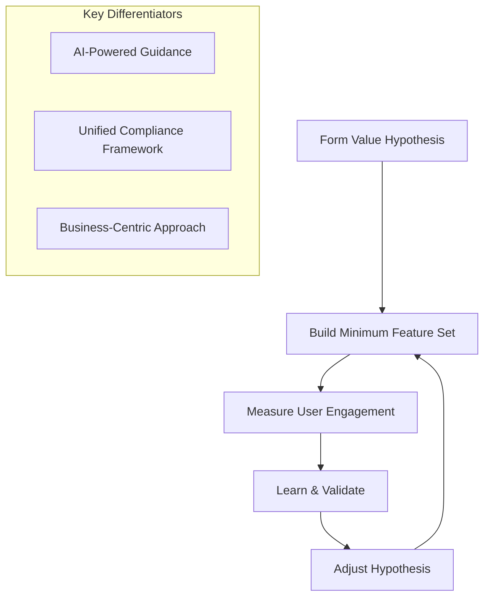
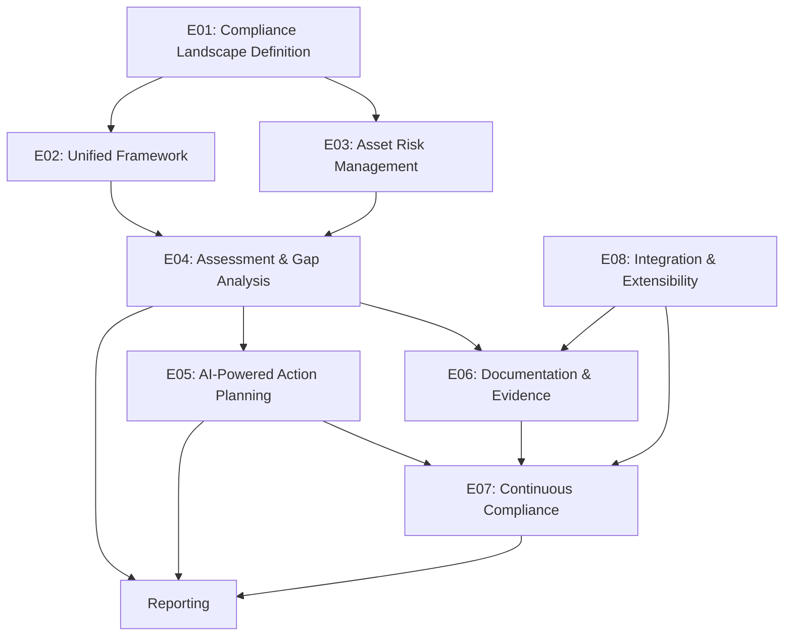
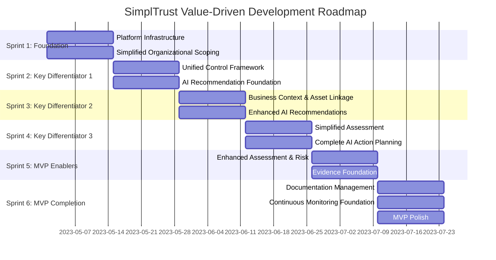

# SimplTrust Documentation

Welcome to the SimplTrust documentation. This repository contains comprehensive documentation for the SimplTrust platform, including product requirements, feature specifications, agile development roadmap, and project management artifacts.

## Overview

SimplTrust is an AI-driven compliance and cybersecurity platform designed specifically for SMEs. It simplifies complex regulatory and risk management challenges through guided workflows, automated gap analysis, and continuous monitoring. The platform follows lean startup principles with a focus on validating key differentiators early while building only the minimal necessary supporting functionality.

## Key Differentiators

1. **AI-Powered Guidance**: Converting complex compliance requirements into actionable tasks with minimal human expertise
2. **Unified Compliance Framework**: Eliminating redundant work across multiple regulatory frameworks
3. **Business-Centric Approach**: Linking compliance to business capabilities and assets for contextual relevance

## Documentation Sections

### Product Context
- **[Fabricon Storyline](docs/product_context/storyline.txt)**: Case study demonstrating SimplTrust in action at a manufacturing company
- **[Platform Capabilities](docs/product_context/capabilities.txt)**: Detailed description of all platform features and capabilities
- **[Platform Flow](docs/product_context/flow.txt)**: Information about the user journey and process flow
- **[Reference Model for GRC](docs/product_context/reference.txt)**: Framework for Governance, Risk, and Compliance

### Requirements
- **[Product Requirements](docs/requirements/product_requirements.md)**: Detailed product requirements from Marketing/Product perspective
- **[UX Requirements](docs/requirements/ux_requirements.md)**: User experience and interface requirements
- **[Software Requirements](docs/requirements/software_requirements.md)**: Technical requirements and architectural considerations

### Agile Development Roadmap
- **[Epics](docs/project_management/epics.md)**: Definition of epics and their value propositions
- **[Roadmap](docs/project_management/roadmap.md)**: Comprehensive agile development roadmap with sprint plans
- **[MVP Definition](docs/mvp_definition/mvp.md)**: Detailed definition of the Minimum Viable Product with value-driven approach

### Architecture
- **[Technical Architecture](docs/architecture/technical_architecture.md)**: Technical architecture and implementation details

### Feature Specifications
- **[Feature Specs Index](docs/feature_specs/index.md)**: Overview of all feature specifications with epic mappings
- **Core Features by Epic**:
  - **E01: Compliance Landscape Definition**
    - [ORG-001: Organizational Scoping](docs/feature_specs/ORG-001_organizational_scoping.md)
    - [ORG-002: Regulatory Questionnaire](docs/feature_specs/ORG-002_regulatory_questionnaire.md)
    - [ORG-003: Business Capability Mapping](docs/feature_specs/ORG-003_business_capability_mapping.md)
    - [ORG-004: Industry Templates](docs/feature_specs/ORG-004_industry_templates.md)
  - **E02: Unified Compliance Framework**
    - [UCF-001: Control Framework Model](docs/feature_specs/UCF-001_control_framework_model.md)
    - [UCF-002: Regulatory Mapping](docs/feature_specs/UCF-002_regulatory_mapping.md)
    - [UCF-003: Control Consolidation](docs/feature_specs/UCF-003_control_consolidation.md)
    - [UCF-004: Framework Visualization](docs/feature_specs/UCF-004_framework_visualization.md)
  - **E03: Asset Risk Management**
    - [ASM-001: Asset Inventory](docs/feature_specs/ASM-001_asset_inventory.md)
    - [ASM-002: Asset Categorization](docs/feature_specs/ASM-002_asset_categorization.md)
    - [ASM-003: Asset Criticality](docs/feature_specs/ASM-003_asset_criticality.md)
    - [ASM-004: Asset-Control Mapping](docs/feature_specs/ASM-004_asset_control_mapping.md)
    - [RSK-001: Risk Assessment](docs/feature_specs/RSK-001_risk_assessment.md)
    - [RSK-002: Risk Visualization](docs/feature_specs/RSK-002_risk_visualization.md)
  - **E04: Assessment & Gap Analysis**
    - [ASP-001: Assessment Templates](docs/feature_specs/ASP-001_assessment_templates.md)
    - [ASP-002: Assessment Execution](docs/feature_specs/ASP-002_assessment_execution.md)
    - [ASP-003: Assessment Scheduling](docs/feature_specs/ASP-003_assessment_scheduling.md)
    - [GAP-001: Gap Identification](docs/feature_specs/GAP-001_gap_identification.md)
    - [GAP-002: Gap Prioritization](docs/feature_specs/GAP-002_gap_prioritization.md)
    - [GAP-003: Gap Reporting](docs/feature_specs/GAP-003_gap_reporting.md)
  - **E05: AI-Powered Action Planning**
    - [ARP-001: AI Recommendation Engine](docs/feature_specs/ARP-001_ai_recommendation_engine.md)
    - [ARP-002: Task Generation](docs/feature_specs/ARP-002_task_generation.md)
    - [ARP-003: Task Prioritization](docs/feature_specs/ARP-003_task_prioritization.md)
    - [ARP-004: Contextual Recommendations](docs/feature_specs/ARP-004_contextual_recommendations.md)
    - [IMP-001: Implementation Dashboard](docs/feature_specs/IMP-001_implementation_dashboard.md)
    - [IMP-002: Task Management](docs/feature_specs/IMP-002_task_management.md)
    - [IMP-003: Evidence Management](docs/feature_specs/IMP-003_evidence_management.md)
    - [IMP-004: Implementation Metrics](docs/feature_specs/IMP-004_implementation_metrics.md)
  - **E06: Documentation & Evidence**
    - [EVD-001: Evidence Storage](docs/feature_specs/EVD-001_evidence_storage.md)
    - [EVD-002: Evidence Linking](docs/feature_specs/EVD-002_evidence_linking.md)
    - [EVD-003: Evidence Search](docs/feature_specs/EVD-003_evidence_search.md)
  - **E07: Continuous Compliance**
    - [TRN-001: Training Modules](docs/feature_specs/TRN-001_training_modules.md)
    - [CMN-001: Compliance Monitoring](docs/feature_specs/CMN-001_compliance_monitoring.md)
    - [CMN-002: Compliance Automation](docs/feature_specs/CMN-002_compliance_automation.md)
  - **E08: Integration & Extensibility**
    - [INT-001: Integration Framework](docs/feature_specs/INT-001_integration_framework.md)
  - **E09: Reporting**
    - [REP-001: Reporting Module](docs/feature_specs/REP-001_reporting_module.md)
    - [REP-002: Executive Dashboard](docs/feature_specs/REP-002_executive_dashboard.md)
    - [REP-003: External Reporting](docs/feature_specs/REP-003_external_reporting.md)
    - [REP-004: Gap Reporting](docs/feature_specs/REP-004_gap_reporting.md)

### Project Management
- **[Kanban Board](docs/project_management/kanban.md)**: Development kanban board with task tracking and value validation points
- **[Project Status](docs/project_management/project_status.md)**: Current project status and progress tracking

## Value-Driven Development Approach

SimplTrust follows lean startup principles to ensure we're building the right features at the right time:

Our development approach focuses on:

1. **Validating key differentiators early**: Building and testing the most unique and valuable features first
2. **Incremental feature delivery**: Implementing minimal versions of features early, then enhancing based on feedback
3. **Learning-focused development**: Structuring work to maximize validated learning about user needs

## Epic Structure

The platform development is organized around 8 epics that represent major value streams:

## Development Timeline

The MVP development is planned over 6 two-week sprints (12 weeks total), focused on validating key differentiators:

## Target Users

SimplTrust is designed for:

- **Small and Medium-Sized Enterprises (SMEs)**: Especially those in regulated industries (manufacturing, automotive, aerospace) with limited IT expertise and resources
- **Compliance and Risk Managers**: Managing multiple regulatory frameworks without extensive manual processes
- **IT Administrators & Operational Managers**: Looking for clear, actionable insights and tracking of cybersecurity measures
- **Consulting and Implementation Partners**: Seeking a guided, scalable platform for client compliance initiatives

## Technical Stack

- **Frontend**: Next.js with TypeScript, Tailwind CSS
- **Backend**: Supabase (PostgreSQL, Authentication, Storage)
- **AI Integration**: OpenAI API or similar for recommendation engine
- **Real-time**: Socket.io for notifications
- **API**: RESTful endpoints with JSON responses
- **Deployment**: Vercel for frontend, Supabase for backend services

## Contributing

For information on contributing to documentation or code, please refer to the project's contribution guidelines.

## License

SimplTrust is proprietary software. All rights reserved. 