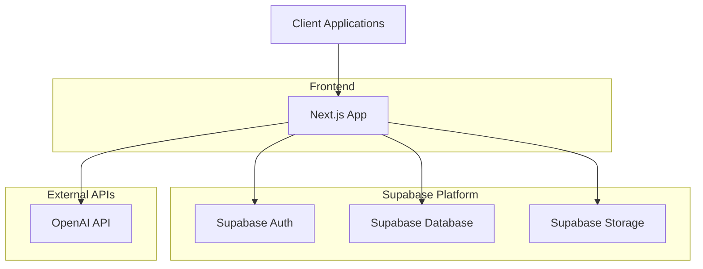
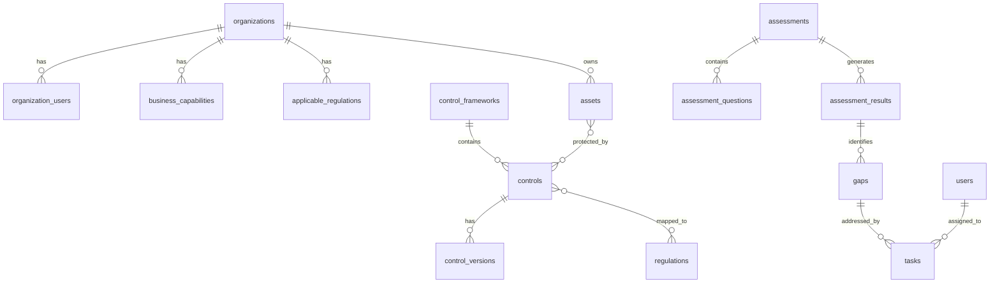
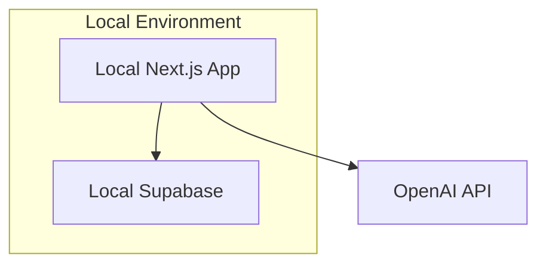
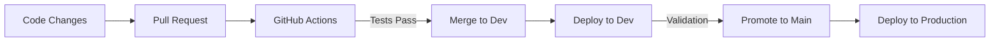

# SimpleTrust Technical Architecture - MVP Approach

## Overview

This document outlines the technical architecture for the SimpleTrust MVP (Minimum Viable Product), focusing on delivering core functionality quickly with a simplified architecture approach. The architecture prioritizes rapid development and validation of key differentiators while maintaining a foundation that can be extended in future iterations.

## MVP Architecture Principles

The SimpleTrust MVP architecture is guided by the following principles:

1. **Simplicity First**: Favoring straightforward solutions over complex architectures to enable rapid development
2. **Full-Stack Efficiency**: Utilizing Supabase to provide both backend and database functionality with minimal setup
3. **Serverless Approach**: Embracing serverless architecture to reduce infrastructure management overhead
4. **Single Codebase**: Maintaining a unified Next.js application for easier team collaboration
5. **Progressive Enhancement**: Building core functionality first, with the ability to enhance features incrementally
6. **Early User Validation**: Designing the architecture to support rapid deployment and feedback collection

## High-Level Architecture

## Core Technology Stack

### Frontend

- **Framework**: Next.js with React and TypeScript
- **State Management**: React Context API and SWR/React Query for data fetching, with consideration for a centralized state management solution such as Redux to better handle real-time UI updates and scalability.
- **UI Components**: Custom design system built with Tailwind CSS
- **Form Management**: React Hook Form with Zod validation

### Backend

- **Platform**: Supabase (BaaS - Backend as a Service)
- **Database**: PostgreSQL (provided by Supabase)
- **Authentication**: Supabase Auth with JWT
- **Storage**: Supabase Storage for file uploads and evidence management
- **Serverless Functions**: Next.js API routes and Supabase Edge Functions when needed
- **AI Integration**: OpenAI API for recommendation engine

### Infrastructure

- **Frontend Hosting**: Vercel (optimized for Next.js)
- **Backend Services**: Supabase (fully managed)
- **CI/CD**: GitHub Actions for continuous integration and deployment
- **Development Environment**: Local development with Supabase CLI

## Simplified Service Architecture

The SimpleTrust MVP consolidates functionality into a more streamlined architecture:

### Next.js Application

The Next.js application serves as both the frontend and API layer:

- **Pages and Components**: React-based UI
- **API Routes**: Serverless backend functions
- **Middleware**: Authentication and request handling

### Supabase Core Services

Supabase provides essential backend functionality:

#### Authentication

- User registration and login
- JWT-based session management
- Role-based access control
- Password reset functionality

#### Database

- PostgreSQL database with Row-Level Security
- Real-time subscriptions for live updates
- Database triggers for automation
- Stored procedures for complex operations

#### Storage

- Secure file uploads and downloads
- Access control based on user permissions
- Organized bucket structure for different asset types

### OpenAI Integration

A simplified integration with OpenAI for the AI recommendation engine:

- API-based communication
- Prompt engineering for accurate recommendations
- Context management for relevant suggestions

## MVP Data Architecture

### Database Schema

The MVP focuses on core tables with room for expansion:

### Table Structure

The MVP implements a simplified table structure focusing on essentials:

1. **Core Tables**
   - users
   - organizations
   - organization_users
   - control_frameworks
   - controls
   - regulations
   - assets
   - assessments
   - gaps
   - tasks

2. **Supporting Tables**
   - business_capabilities
   - applicable_regulations
   - control_versions
   - assessment_questions
   - assessment_results

### Data Access Patterns

- Row-Level Security (RLS) policies for data isolation
- Organization-based access control
- Service roles for system operations
- User roles for permission management

## Security Architecture - MVP

### Authentication & Authorization

- **Supabase Auth**: Handling user authentication and session management
- **JWT Tokens**: Secure, short-lived tokens for API authorization
- **Role-Based Access**: Basic roles (Admin, User) with permission sets
- **Row-Level Security**: Database-level access control based on user context

### Data Protection

- **TLS Encryption**: All communication over HTTPS
- **At-Rest Encryption**: Database encryption provided by Supabase
- **Secure Environment Variables**: For API keys and secrets

### API Security

- **Input Validation**: Request validation using Zod
- **CORS Policies**: Restricted access to frontend domains
- **Rate Limiting**: Basic protection against abuse

## MVP Development & Deployment

### Local Development

### CI/CD Workflow

### Environments

- **Development**: For ongoing feature development
- **Production**: For user-facing MVP

## Integration Approach

The MVP focuses on essential integrations:

### OpenAI Integration

- Simple REST API integration
- Focused prompts for recommendation quality
- Minimal context management

### Future Integration Points

- Webhook endpoints for future integrations
- API endpoints designed for extensibility
- Authentication methods that support future SSO

## Next Steps

As the MVP is implemented, the architecture will evolve based on:

1. **User Feedback**: Adjusting based on user needs and pain points
2. **Performance Optimization**: Addressing any bottlenecks identified during usage
3. **Feature Expansion**: Extending the architecture to support additional features
4. **Scalability Needs**: Adapting as user base and data volume grow

## Conclusion

This MVP architecture provides a streamlined approach to building the SimpleTrust platform, focusing on Supabase for backend services and Next.js for frontend development. By embracing a simplified architecture, the team can rapidly implement and validate key features while establishing a foundation that can evolve as the product matures.

The approach prioritizes delivery speed and validation of core value propositions, with careful consideration given to future extensibility. As the product evolves beyond MVP, the architecture can be enhanced to incorporate more sophisticated components and services as justified by user needs and business requirements.

## API Design Enhancements

Our RESTful API will be versioned under the /api/v1 prefix to ensure backward compatibility. We will enforce standardized JSON response formats, including consistent error handling. Feature toggles will be integrated to enable gradual rollout of new functionalities without impacting existing services.

## Real-Time Communication Enhancements

In addition to using Supabase's real-time subscriptions for database events, we are evaluating the integration of dedicated real-time communication (e.g., Socket.io) to support interactive UI features such as live notifications, drag-and-drop updates, and dynamic dashboard widgets. This will complement our current infrastructure and ensure better responsiveness in highly interactive use cases. 