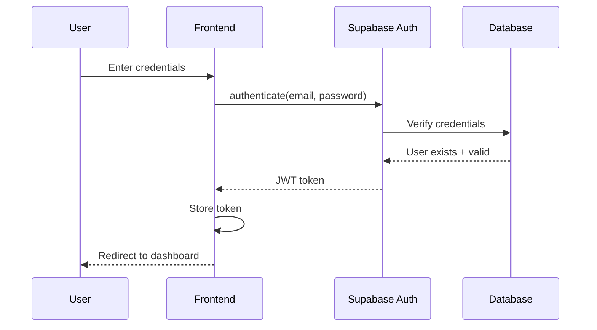
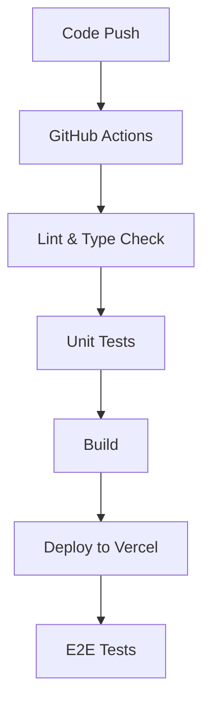

# INFRA-001: Infrastructure Setup

## Overview

The Infrastructure Setup feature provides the foundational technical platform upon which all other features are built. It includes the core project setup, backend services, authentication, deployment configuration, and continuous integration pipeline.

## Epic

- **E00: Foundation**

## Business Value

- Ensures a scalable, secure, and efficient platform foundation
- Enables rapid development and deployment of other features
- Provides consistent environment configurations across development and production
- Supports automated testing and deployment processes

## User Stories

- **As a Developer**  
  I need a well-structured Next.js project with TypeScript configuration so that I can develop features efficiently with type safety and follow best practices.

- **As a Developer**  
  I need Supabase backend services configured so that I can implement authentication, database, and storage functionality without building these services from scratch.

- **As a User**  
  I need a secure authentication system so that I can safely access my organization's compliance data.

- **As a Platform Owner**  
  I need an automated deployment process so that new features and fixes can be delivered quickly and reliably.

- **As a Platform Owner**  
  I need monitoring and logging systems so that I can ensure the platform is running efficiently and identify issues quickly.

## Feature Components

| ID | Component | Description | Priority |
|----|-----------|-------------|----------|
| INFRA-001-000 | Next.js Project Initialization | Set up the Next.js application with TypeScript, ESLint, Prettier, and directory structure | High |
| INFRA-001-001 | Supabase Backend Setup | Configure Supabase services, database schema, and row-level security policies | High |
| INFRA-001-002 | Authentication System | Implement user authentication with Supabase Auth, including signup, login, password reset, and role-based access control | High |
| INFRA-001-003 | Vercel Deployment | Configure Vercel for hosting the frontend application with proper environment variables and deployment settings | High |
| INFRA-001-004 | CI/CD Pipeline | Set up GitHub Actions for continuous integration and deployment, including automated testing and linting | Medium |
| INFRA-001-005 | Monitoring and Logging | Configure production monitoring and logging with appropriate services | Medium |
| INFRA-001-006 | Environment Configuration | Set up environment-specific configurations for development, testing, and production | High |
| INFRA-001-007 | Security Hardening | Implement security best practices, including CORS, CSP, and proper secret management | High |

## Technical Design

### Next.js Project Structure

```
simpletrust/
├── src/
│   ├── pages/
│   │   ├── api/
│   │   │   └── [...nextauth].ts
│   │   ├── _app.tsx
│   │   └── index.tsx
│   ├── components/
│   │   ├── common/
│   │   ├── layout/
│   │   └── ui/
│   ├── hooks/
│   ├── contexts/
│   ├── services/
│   ├── utils/
│   └── types/
├── public/
├── styles/
├── tests/
├── .env.example
├── .env.local
├── .eslintrc.js
├── .prettierrc
├── next.config.js
├── package.json
└── tsconfig.json
```

### Database Schema Foundation

```sql
-- Core tables for authentication and organization
CREATE TABLE organizations (
  id UUID PRIMARY KEY DEFAULT uuid_generate_v4(),
  name TEXT NOT NULL,
  created_at TIMESTAMP WITH TIME ZONE DEFAULT NOW(),
  updated_at TIMESTAMP WITH TIME ZONE DEFAULT NOW()
);

-- Linking table between organization and users
CREATE TABLE organization_users (
  id UUID PRIMARY KEY DEFAULT uuid_generate_v4(),
  organization_id UUID REFERENCES organizations(id) ON DELETE CASCADE,
  user_id UUID REFERENCES auth.users(id) ON DELETE CASCADE,
  role TEXT NOT NULL,
  created_at TIMESTAMP WITH TIME ZONE DEFAULT NOW(),
  updated_at TIMESTAMP WITH TIME ZONE DEFAULT NOW(),
  UNIQUE(organization_id, user_id)
);

-- Row Level Security
ALTER TABLE organizations ENABLE ROW LEVEL SECURITY;
ALTER TABLE organization_users ENABLE ROW LEVEL SECURITY;

-- Policies
CREATE POLICY "Users can view their own organizations" ON organizations
  FOR SELECT USING (
    id IN (
      SELECT organization_id FROM organization_users
      WHERE user_id = auth.uid()
    )
  );
```

### Authentication Flow



### CI/CD Pipeline



## Acceptance Criteria

1. **Next.js Project Initialization**
   - Project structure follows the defined layout
   - TypeScript is configured with strict type checking
   - ESLint and Prettier are configured and working
   - All developer dependencies are properly documented

2. **Supabase Backend Setup**
   - Supabase project is created and configured
   - Database schema is initialized with core tables
   - Row-level security policies are in place
   - Local development environment is configured with Supabase CLI

3. **Authentication System**
   - Users can sign up with email and password
   - Users can log in and log out
   - Users can reset their password
   - Authentication state is properly managed in the frontend
   - Role-based access control is implemented

4. **Vercel Deployment**
   - Application can be deployed to Vercel
   - Environment variables are properly configured
   - Production, staging, and preview environments are set up
   - Domain configuration is completed

5. **CI/CD Pipeline**
   - GitHub Actions workflow is configured
   - Code linting and type checking run on pull requests
   - Unit tests run on pull requests
   - Automated deployment to Vercel on merge to main branch

6. **Monitoring and Logging**
   - Error tracking is configured (e.g., Sentry)
   - Performance monitoring is in place
   - API logs are captured and accessible

## Dependencies

- Next.js framework must be the latest stable version
- Supabase account and project must be created
- Vercel account and project must be created
- GitHub repository must be set up with proper access controls

## Implementation Notes

- Use environment variables for all configuration settings
- Follow security best practices for authentication and data access
- Ensure proper error handling throughout the infrastructure
- Document all setup procedures for new developers
- Create comprehensive getting started guides

## Future Considerations

- Implement SSO authentication for enterprise customers
- Add advanced monitoring and alerting features
- Set up automated database backups and recovery procedures
- Create infrastructure-as-code definitions for easier scaling
- Implement feature flags for controlled rollout of new features 