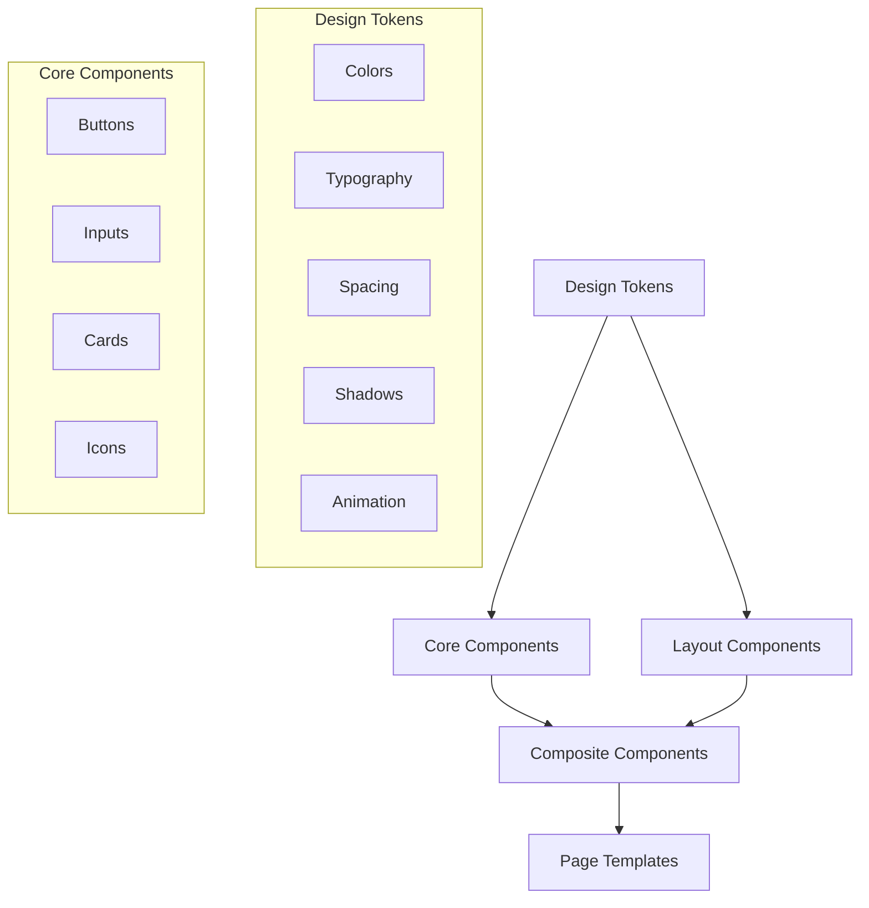
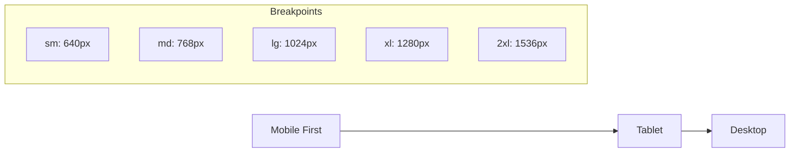

# UX-001: Core UI Foundation

## Overview

The Core UI Foundation feature provides the essential user interface components, design system, and interaction patterns that will be used throughout the SimplTrust platform. It establishes the visual language, accessibility standards, and responsive behaviors that ensure a consistent, high-quality user experience.

## Epic

- **E00: Foundation**

## Business Value

- Creates a consistent, professional user experience across all platform features
- Reduces development time through reusable UI components
- Ensures accessibility compliance from the beginning
- Provides a scalable foundation for future UI development
- Enhances platform credibility through professional design

## User Stories

- **As a User**  
  I need a clean, intuitive interface so that I can navigate the platform effectively without extensive training.

- **As a Developer**  
  I need a comprehensive design system so that I can create new UI components that maintain visual consistency with existing elements.

- **As a User with Accessibility Needs**  
  I need an accessible interface that follows WCAG guidelines so that I can use the platform effectively with assistive technologies.

- **As a Mobile User**  
  I need a responsive design so that I can access the platform from different devices and screen sizes.

- **As a Business Stakeholder**  
  I need a professional, branded interface so that the platform instills confidence in users and reflects our quality standards.

## Feature Components

| ID | Component | Description | Priority |
|----|-----------|-------------|----------|
| UX-001-000 | Design Mockups and Wireframes | Create initial design mockups and wireframes for key platform screens | High |
| UX-001-001 | Organizational Scoping UI | Design the user interface for the organizational scoping module | High |
| UX-001-002 | Core Design System | Develop a comprehensive design system with color palette, typography, spacing, and basic UI elements | High |
| UX-001-003 | Responsive Layouts | Implement responsive design for tablet and mobile devices | Medium |
| UX-001-004 | Accessibility Compliance | Ensure WCAG 2.1 AA compliance throughout the UI | Medium |
| UX-001-005 | Framework Visualization Components | Design visualization components for the unified control framework | Medium |
| UX-001-006 | UI Polish and Refinement | Final visual refinements and polish for MVP release | Medium |
| UX-001-007 | Animation and Microinteractions | Add subtle animations and microinteractions to enhance user experience | Low |

## Technical Design

### Core Component Library Structure

```
src/
└── components/
    ├── ui/
    │   ├── Button/
    │   │   ├── Button.tsx
    │   │   ├── Button.test.tsx
    │   │   └── index.ts
    │   ├── Card/
    │   ├── Input/
    │   ├── Select/
    │   ├── Modal/
    │   ├── Table/
    │   ├── Alert/
    │   ├── Toast/
    │   ├── Dropdown/
    │   └── Typography/
    ├── layout/
    │   ├── Sidebar/
    │   ├── Header/
    │   ├── Footer/
    │   ├── Container/
    │   └── Grid/
    └── common/
        ├── FormField/
        ├── SearchBar/
        ├── Pagination/
        ├── Breadcrumbs/
        └── EmptyState/
```

### Design System Foundations



### Responsive Design Approach



### Color System

Primary Colors:
- Primary: #2563EB (Blue)
- Secondary: #0F172A (Dark Blue)
- Accent: #7C3AED (Purple)

Supporting Colors:
- Success: #10B981 (Green)
- Warning: #F59E0B (Amber)
- Error: #EF4444 (Red)
- Info: #3B82F6 (Light Blue)

Neutral Colors:
- Gray scale from #F9FAFB (Gray-50) to #111827 (Gray-900)

## Accessibility Standards

- All interactive elements must have proper focus states
- Color contrast ratios must meet WCAG 2.1 AA standards (4.5:1 for normal text, 3:1 for large text)
- All interactive elements must be accessible via keyboard navigation
- Form elements must have proper labels and error states
- Icons and decorative elements must have proper alt text or be hidden from screen readers
- Content must maintain hierarchy and logical reading order
- Touch targets must be at least 44x44 pixels on mobile devices

## Acceptance Criteria

1. **Design Mockups and Wireframes**
   - Mockups provided for key user flows
   - Visual design language established
   - Design assets organized and available to developers

2. **Core Design System**
   - Design tokens implemented (colors, typography, spacing, etc.)
   - Basic UI components created and documented
   - Component variations for different states (hover, active, disabled)
   - Components properly typed with TypeScript
   - Components tested for functionality and accessibility

3. **Responsive Layouts**
   - All pages adapt to mobile, tablet, and desktop viewports
   - No horizontal scrolling on supported devices
   - Touch-friendly UI on mobile devices
   - Consistent experience across different screen sizes

4. **Accessibility Compliance**
   - Screen reader compatibility verified
   - Keyboard navigation tested and functional
   - Color contrast meets WCAG 2.1 AA standards
   - Form inputs have proper labels and error messages
   - Interactive elements have adequate focus states

5. **UI Polish and Refinement**
   - Consistent spacing throughout the interface
   - Typography hierarchy maintained
   - Visual feedback for user interactions
   - Loading states and empty states designed

## Dependencies

- INFRA-001-000: Next.js Project Initialization
- Tailwind CSS must be configured
- Icon library must be selected and integrated
- Design tools and assets must be established

## Implementation Notes

- Use CSS variables for design tokens to maintain consistency
- Implement components with proper accessibility attributes
- Document component usage and props in code comments or Storybook
- Ensure all components are responsive by default
- Test components across various browsers and devices

## Future Considerations

- Create a Storybook instance to document and showcase UI components
- Develop more advanced components for data visualization
- Implement theming capabilities for white-labeling
- Add dark mode support
- Create a comprehensive UI component testing strategy 