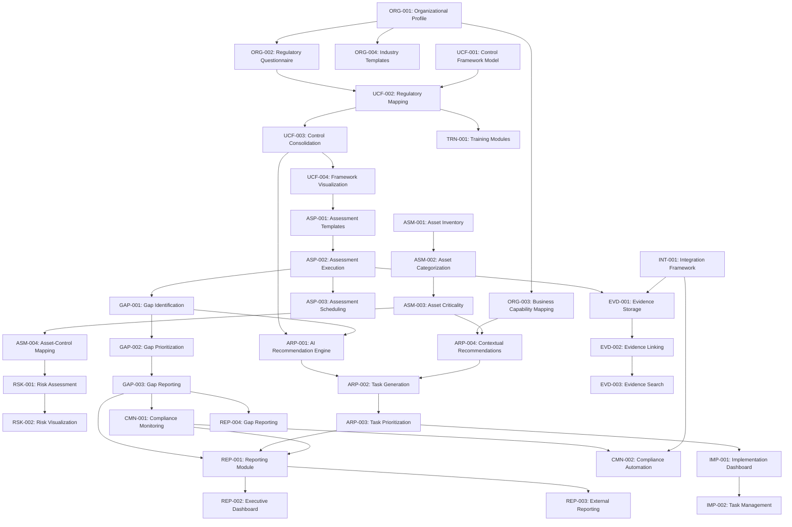

# SimplTrust Feature Specifications

This directory contains detailed specifications for all features of the SimplTrust platform. Each specification follows a consistent format to ensure comprehensive documentation of requirements, implementation details, and testing strategies.

## Epics and Features

Features are organized under epics that represent major value streams. This structure allows us to focus development on delivering complete value propositions rather than isolated functionality.

| Epic ID | Epic Name | Description | Priority |
|---------|-----------|-------------|----------|
| E00 | Foundation | Establish technical and UI infrastructure foundation | High |
| E01 | Compliance Landscape Definition | Define regulatory landscape and map to business capabilities | High |
| E02 | Unified Compliance Framework | Create consolidated control framework across regulations | High |
| E03 | Asset Risk Management | Manage assets and determine security priorities | High |
| E04 | Assessment & Gap Analysis | Evaluate compliance and identify gaps | Medium |
| E05 | AI-Powered Action Planning | Generate actionable recommendations and tasks | High |
| E06 | Documentation & Evidence | Maintain compliance documentation | Medium |
| E07 | Continuous Compliance | Enable ongoing monitoring and improvement | Low |
| E08 | Integration & Extensibility | Connect with external systems and extend platform capabilities | Low |
| E09 | Reporting | Generate comprehensive reports and dashboards for various stakeholders | Medium |

For complete epic definitions, see [Epics](../project_management/epics.md).

## Complete MVP Feature Set

The following features comprise the Minimum Viable Product for SimplTrust, prioritized according to their role in validating key differentiators:

### Epic E00: Foundation

| Feature ID | Feature Name | Description | Priority | Implementation Sprint |
|------------|--------------|-------------|----------|----------------------|
| [INFRA-001](./INFRA-001_infrastructure_setup.md) | Infrastructure Setup | Core technical platform setup including Next.js project, Supabase backend, authentication, and deployment | High | 1 |
| [UX-001](./UX-001_core_ui_foundation.md) | Core UI Foundation | Design system, UI components, and interaction patterns that ensure a consistent user experience | High | 1 |

### Epic E01: Compliance Landscape Definition

| Feature ID | Feature Name | Description | Priority | Implementation Sprint |
|------------|--------------|-------------|----------|----------------------|
| [ORG-001](./ORG-001_organizational_scoping.md) | Organizational Profile | Create and manage organizational profile with industry and size classification | High | 1 |
| [ORG-002](./ORG-002_regulatory_questionnaire.md) | Regulatory Questionnaire | Simplified questionnaire to identify applicable regulations | High | 1 |
| [ORG-003](./ORG-003_business_capability_mapping.md) | Business Capability Mapping | Map business capabilities and link to compliance domains | High | 3 |
| [ORG-004](./ORG-004_industry_templates.md) | Industry Templates | Pre-configured templates for common industries | Medium | 1-3 |

### Epic E02: Unified Compliance Framework

| Feature ID | Feature Name | Description | Priority | Implementation Sprint |
|------------|--------------|-------------|----------|----------------------|
| [UCF-001](./UCF-001_control_framework_model.md) | Control Framework Model | Data model for unified control framework | High | 2 |
| [UCF-002](./UCF-002_regulatory_mapping.md) | Regulatory Mapping | Map regulatory requirements to control framework | High | 2 |
| [UCF-003](./UCF-003_control_consolidation.md) | Control Consolidation | Identify and consolidate overlapping controls | High | 2 |
| [UCF-004](./UCF-004_framework_visualization.md) | Framework Visualization | Visual representation of control framework | Medium | 2 |

### Epic E03: Asset Risk Management

| Feature ID | Feature Name | Description | Priority | Implementation Sprint |
|------------|--------------|-------------|----------|----------------------|
| [ASM-001](./ASM-001_asset_inventory.md) | Asset Inventory | Create and manage inventory of assets | High | 3 |
| [ASM-002](./ASM-002_asset_categorization.md) | Asset Categorization | Categorize and tag assets | High | 3 |
| [ASM-003](./ASM-003_asset_criticality.md) | Asset Criticality | Define criticality ratings for assets | High | 3 |
| [ASM-004](./ASM-004_asset_control_mapping.md) | Asset-Control Mapping | Link assets to applicable controls | High | 3 |
| [RSK-001](./RSK-001_risk_assessment.md) | Risk Assessment | Evaluate risks based on asset criticality and gaps | Medium | 5 |
| [RSK-002](./RSK-002_risk_visualization.md) | Risk Visualization | Visual representation of risk landscape | Medium | 5 |

### Epic E04: Assessment & Gap Analysis

| Feature ID | Feature Name | Description | Priority | Implementation Sprint |
|------------|--------------|-------------|----------|----------------------|
| [ASP-001](./ASP-001_assessment_templates.md) | Assessment Templates | Templates for common compliance assessments | Medium | 4 |
| [ASP-002](./ASP-002_assessment_execution.md) | Assessment Execution | Execute assessment against control framework | Medium | 4 |
| [ASP-003](./ASP-003_assessment_scheduling.md) | Assessment Scheduling | Schedule assessments with notifications | Low | 5 |
| [GAP-001](./GAP-001_gap_identification.md) | Gap Identification | Identify compliance gaps from assessments | Medium | 4 |
| [GAP-002](./GAP-002_gap_prioritization.md) | Gap Prioritization | Prioritize gaps based on criticality | Medium | 4-5 |
| [GAP-003](./GAP-003_gap_reporting.md) | Gap Reporting | Generate reports on compliance gaps | Medium | 5 |

### Epic E05: AI-Powered Action Planning

| Feature ID | Feature Name | Description | Priority | Implementation Sprint |
|------------|--------------|-------------|----------|----------------------|
| [ARP-001](./ARP-001_ai_recommendation_engine.md) | AI Recommendation Engine | Generate AI-powered recommendations | High | 2-4 |
| [ARP-002](./ARP-002_task_generation.md) | Task Generation | Convert recommendations to actionable tasks | High | 4 |
| [ARP-003](./ARP-003_task_prioritization.md) | Task Prioritization | Prioritize tasks based on impact and effort | High | 4 |
| [ARP-004](./ARP-004_contextual_recommendations.md) | Contextual Recommendations | Enhance recommendations with business context | High | 3 |
| [IMP-001](./IMP-001_implementation_dashboard.md) | Implementation Dashboard | Dashboard for tracking implementation progress | Medium | 4 |
| [IMP-002](./IMP-002_task_management.md) | Task Management | Manage and update task status | Medium | 4 |

### Epic E06: Documentation & Evidence

| Feature ID | Feature Name | Description | Priority | Implementation Sprint |
|------------|--------------|-------------|----------|----------------------|
| [EVD-001](./EVD-001_evidence_storage.md) | Evidence Storage | Store and organize evidence documents | Medium | 5-6 |
| [EVD-002](./EVD-002_evidence_linking.md) | Evidence Linking | Link evidence to controls and assessments | Medium | 6 |
| [EVD-003](./EVD-003_evidence_search.md) | Evidence Search | Search and filter evidence | Low | 6 |

### Epic E07: Continuous Compliance

| Feature ID | Feature Name | Description | Priority | Implementation Sprint |
|------------|--------------|-------------|----------|----------------------|
| [TRN-001](./TRN-001_training_modules.md) | Training Modules | Basic training module framework | Low | 6 |
| [CMN-001](./CMN-001_compliance_monitoring.md) | Compliance Monitoring | Monitor compliance status over time | Low | 6 |
| [CMN-002](./CMN-002_compliance_automation.md) | Compliance Automation | Automate compliance verification and remediation | Low | Post-MVP |

### Epic E08: Integration & Extensibility

| Feature ID | Feature Name | Description | Priority | Implementation Sprint |
|------------|--------------|-------------|----------|----------------------|
| [INT-001](./INT-001_integration_framework.md) | Integration Framework | Connect with external systems and data sources | Low | Post-MVP |

### Epic E09: Reporting

| Feature ID | Feature Name | Description | Priority | Implementation Sprint |
|------------|--------------|-------------|----------|----------------------|
| [REP-001](./REP-001_reporting_module.md) | Reporting Module | Core reporting functionality with customizable templates | Medium | 4-6 |
| [REP-002](./REP-002_executive_dashboard.md) | Executive Dashboard | High-level dashboard for executive stakeholders | Medium | 5-6 |
| [REP-003](./REP-003_external_reporting.md) | External Reporting | Generate reports for external auditors and regulators | Medium | 6 |
| [REP-004](./REP-004_gap_reporting.md) | Gap Reporting | Detailed reports on compliance gaps and remediation progress | Medium | 5 |

## Value-Driven Implementation Strategy

Following lean startup principles, our implementation strategy organizes features to validate key differentiators early:

### Sprint 1: Platform Foundation & Basic Regulatory Scoping
- Focus: Basic infrastructure and simplified organizational scoping
- Key Features: ORG-001, ORG-002, ORG-004 (manufacturing templates only)
- Value Hypothesis: Users can quickly identify applicable regulations without deep expertise

### Sprint 2: Unified Framework & AI Foundation
- Focus: Consolidated control framework and AI foundation
- Key Features: UCF-001, UCF-002, UCF-003, UCF-004, ARP-001 (foundation)
- Value Hypothesis: Control consolidation provides tangible efficiency gains

### Sprint 3: Business Context & Asset Management
- Focus: Asset inventory and business context
- Key Features: ASM-001, ASM-002, ASM-003, ASM-004, ORG-003, ARP-004
- Value Hypothesis: Business context improves compliance decision-making

### Sprint 4: Simplified Assessment & Task Management
- Focus: Basic assessment capabilities and complete task management
- Key Features: ASP-001, ASP-002, GAP-001, GAP-002, ARP-001 (complete), ARP-002, ARP-003, IMP-001, IMP-002
- Value Hypothesis: AI recommendations save time and reduce expertise requirements

### Sprint 5: Enhanced Assessment & Risk Analysis
- Focus: Complete assessment capabilities and risk management
- Key Features: ASP-003, GAP-003, RSK-001, RSK-002, EVD-001 (foundation)
- Value Hypothesis: Risk-based prioritization enhances decision-making

### Sprint 6: Documentation & MVP Completion
- Focus: Evidence management and MVP polish
- Key Features: EVD-001 (complete), EVD-002, EVD-003, TRN-001, CMN-001
- Value Hypothesis: Documentation management provides audit readiness value

## Feature Dependencies

The following diagram illustrates the key dependencies between features:

## Development Timeline

For a detailed development timeline, please refer to the [Agile Roadmap](../agile_roadmap/roadmap.md) document. 