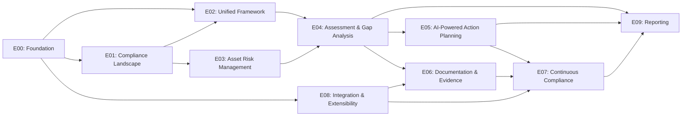
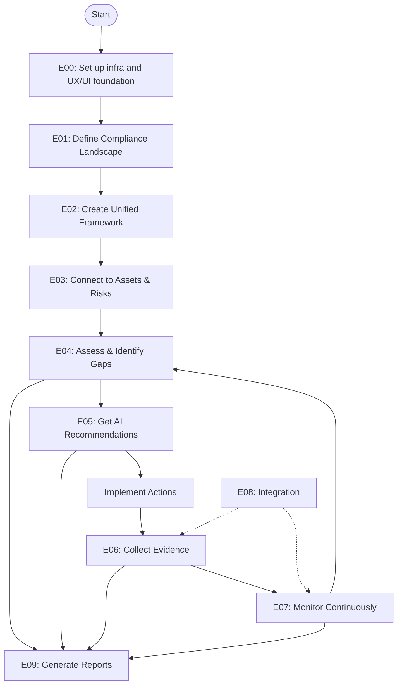

# SimplTrust Epics

## Overview

This document defines the high-level epics for the SimplTrust platform. Epics represent larger bodies of work that can be broken down into multiple features and user stories. They help organize the development effort around key business objectives and value streams.

## Epic Definitions

| Epic ID | Epic Name | Description | Key Value Proposition | Features |
|---------|-----------|-------------|----------------------|----------|
| E00 | Foundation | Core platform infrastructure and foundational components necessary for all other epics | Create a scalable, secure, and efficient platform foundation | INFRA-001, UX-001 |
| E01 | Compliance Landscape Definition | Enable organizations to efficiently define their regulatory landscape, understand applicable requirements, and map business capabilities to compliance domains | Reduce time and expertise needed to identify applicable regulations | ORG-001, ORG-002, ORG-003, ORG-004 |
| E02 | Unified Compliance Framework | Eliminate redundancy across multiple regulatory frameworks by creating a consolidated control set that maps to all applicable regulations | Reduce compliance overhead by 40-60% through control consolidation | UCF-001, UCF-002, UCF-003, UCF-004 |
| E03 | Asset Risk Management | Create and maintain a comprehensive inventory of assets, linking them to compliance controls and determining critical security priorities | Enable prioritization based on business impact and criticality | ASM-001, ASM-002, ASM-003, ASM-004, RSK-001, RSK-002 |
| E04 | Assessment & Gap Analysis | Streamline the assessment process, identify compliance gaps, and report on compliance status | Provide clear visibility into compliance gaps with actionable insights | ASP-001, ASP-002, ASP-003, GAP-001, GAP-002, GAP-003 |
| E05 | AI-Powered Action Planning | Generate specific, actionable recommendations and tasks based on identified gaps | Convert complex compliance requirements into clear, prioritized actions | ARP-001, ARP-002, ARP-003, ARP-004, IMP-001, IMP-002, IMP-003, IMP-004 |
| E06 | Documentation & Evidence | Organize and maintain compliance documentation and evidence for audits and verification | Ensure audit readiness and reduce time spent on compliance documentation | EVD-001, EVD-002, EVD-003 |
| E07 | Continuous Compliance | Enable ongoing monitoring and improvement of compliance posture | Move from point-in-time to continuous compliance | CMN-001, CMN-002, TRN-001 |
| E08 | Integration & Extensibility | Provide capabilities to connect the platform with external systems and extend functionality | Enable seamless integration with existing tools and workflows | INT-001 |
| E09 | Reporting | Generate comprehensive reports and dashboards for various stakeholders with appropriate level of detail | Provide clear visibility into compliance status and support decision-making | REP-001, REP-002, REP-003, REP-004 |

## Value Stream Mapping

The following diagram shows how these epics relate to the value stream of the SimplTrust platform:

## Key Differentiators and MVP Focus

We've identified the following key differentiators that provide the most unique value to our target market:

1. **AI-Powered Guidance (E05)** - Converting complex compliance requirements into actionable tasks with minimal human expertise
2. **Unified Compliance Framework (E02)** - Eliminating redundant work across multiple regulatory frameworks
3. **Business-Centric Approach (E01, E03)** - Linking compliance to business capabilities and assets for contextual relevance

Our MVP will prioritize these differentiators while building only the minimal necessary supporting functionality.

## Epic Prioritization Strategy

Instead of a sequential approach based on the platform's logical flow, we're prioritizing based on:

1. **Validating key assumptions about differentiators** - Building the unique value propositions early to test with customers
2. **Establishing minimum required foundations** - Building only what's necessary to support the differentiators
3. **Maximizing learning opportunities** - Focusing on features that will generate the most valuable feedback

This approach aligns with lean startup principles by enabling rapid validation of our core value hypotheses.

## User Journey and Epic Relationships

The following diagram shows how users will experience the value from these epics:

## Feature Mapping

The feature codes referenced in the epics above map to the following features:
### E00: Foundation
- **INFRA-001**: Infrastructure Setup
- **UX-001**: Core UX/UI Foundation 

### E01: Compliance Landscape Definition
- **ORG-001**: Organizational Scoping
- **ORG-002**: Regulatory Questionnaire
- **ORG-003**: Business Capability Mapping
- **ORG-004**: Industry Templates

### E02: Unified Compliance Framework
- **UCF-001**: Control Framework Model
- **UCF-002**: Regulatory Mapping
- **UCF-003**: Control Consolidation
- **UCF-004**: Framework Visualization

### E03: Asset Risk Management
- **ASM-001**: Asset Inventory
- **ASM-002**: Asset Categorization
- **ASM-003**: Asset Criticality
- **ASM-004**: Asset-Control Mapping
- **RSK-001**: Risk Assessment
- **RSK-002**: Risk Visualization

### E04: Assessment & Gap Analysis
- **ASP-001**: Assessment Templates
- **ASP-002**: Assessment Execution
- **ASP-003**: Assessment Scheduling
- **GAP-001**: Gap Identification
- **GAP-002**: Gap Prioritization
- **GAP-003**: Gap Reporting

### E05: AI-Powered Action Planning
- **ARP-001**: AI Recommendation Engine
- **ARP-002**: Task Generation
- **ARP-003**: Task Prioritization
- **ARP-004**: Contextual Recommendations
- **IMP-001**: Implementation Dashboard
- **IMP-002**: Task Management
- **IMP-003**: Evidence Management
- **IMP-004**: Implementation Metrics

### E06: Documentation & Evidence
- **EVD-001**: Evidence Storage
- **EVD-002**: Evidence Linking
- **EVD-003**: Evidence Search

### E07: Continuous Compliance
- **TRN-001**: Training Modules
- **CMN-001**: Compliance Monitoring
- **CMN-002**: Compliance Automation

### E08: Integration & Extensibility
- **INT-001**: Integration Framework

### E09: Reporting
- **REP-001**: Reporting Module
- **REP-002**: Executive Dashboard
- **REP-003**: External Reporting
- **REP-004**: Gap Reporting