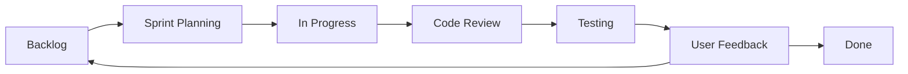

# SimplTrust Kanban Board

## Overview

This Kanban board represents the development workflow for the SimplTrust platform, tracking tasks from backlog through implementation to completion. The board is organized into columns representing the development stages, with tasks categorized by epic, feature, and sprint.

Our development approach follows lean startup principles, focusing on validating key differentiators early and building only the necessary supporting functionality.

## Development Approach

We are guided by the following principles:

1. **Value-Driven Development**: We prioritize features that deliver the most value to users early
2. **Hypothesis Validation**: We test key assumptions through rapid iterations
3. **Incremental Delivery**: We build the platform in small, functional increments
4. **Continuous Feedback**: We incorporate user feedback throughout the development process

## Board Structure

## Current Sprint: Sprint 1 - Platform Foundation & Simplified Organizational Scoping

### Backlog

- [ ] **INFRA-001-004**: Configure CI/CD pipeline with GitHub Actions
- [ ] **INFRA-001-005**: Set up monitoring and logging
- [ ] **ORG-001-003**: Create industry-specific templates for automotive sector
- [ ] **ORG-001-004**: Create industry-specific templates for aerospace sector
- [ ] **ORG-001-005**: Implement business capability mapping visualization
- [ ] **UX-001-003**: Design responsive layouts for tablet and mobile
- [ ] **UX-001-004**: Create accessibility conformance testing plan
- [ ] **AI-001-001**: Implement advanced AI recommendation capabilities
- [ ] **REP-002-001**: Develop executive dashboard (Post-MVP)
- [ ] **REP-003-001**: Implement external reporting capabilities (Post-MVP)
- [ ] **IMP-004-001**: Implement implementation metrics (Post-MVP)

### Sprint Planning

- [ ] **INFRA-001-001**: Set up Supabase backend infrastructure (Epic: Foundation)
- [ ] **INFRA-001-002**: Implement user authentication system (Epic: Foundation)
- [ ] **INFRA-001-003**: Configure Vercel deployment (Epic: Foundation)
- [ ] **ORG-001-001**: Implement simplified regulatory questionnaire (Epic: E01)
- [ ] **ORG-001-002**: Create industry-specific templates for manufacturing sector (Epic: E01)
- [ ] **UX-001-001**: Design organizational scoping module UI (Epic: E01)
- [ ] **UX-001-002**: Create basic design system for consistent UI (Epic: Foundation)
- [ ] **AI-001-000**: Set up AI service integration foundation (Epic: E05)

### In Progress

- [ ] **INFRA-001-000**: Initialize Next.js project with TypeScript (Epic: Foundation)
- [ ] **UX-001-000**: Create initial design mockups and wireframes (Epic: Foundation)

### Code Review

No items currently in code review.

### Testing

No items currently in testing.

### User Feedback

No items currently in user feedback phase.

### Done

No items completed yet.

## Upcoming Sprint: Sprint 2 - Unified Framework & AI Recommendation Foundation

### Backlog

- [ ] **UCF-001-001**: Implement control framework data model (Epic: E02)
- [ ] **UCF-001-002**: Create regulatory mapping for ISO 27001 (Epic: E02)
- [ ] **UCF-001-003**: Create regulatory mapping for NIS2 (Epic: E02)
- [ ] **UCF-001-004**: Develop UI for unified control framework visualization (Epic: E02)
- [ ] **ARP-001-001**: Implement AI recommendation engine foundation (Epic: E05)
- [ ] **ARP-001-002**: Create initial recommendation templates for common gaps (Epic: E05)
- [ ] **ORG-001-006**: Enhance business capability mapping (Epic: E01)
- [ ] **UX-001-005**: Design unified framework visualization components (Epic: E02)

## Future Sprints

### Sprint 3 - Business Context & Asset Linkage

- [ ] **ASM-001-001**: Implement basic asset inventory functionality (Epic: E03)
- [ ] **ASM-001-002**: Create asset categorization and tagging system (Epic: E03)
- [ ] **ASM-001-003**: Implement asset criticality rating (Epic: E03)
- [ ] **ASM-001-004**: Develop asset-to-control linking functionality (Epic: E03)
- [ ] **ARP-001-003**: Enhance AI recommendations with business context (Epic: E05)
- [ ] **ORG-001-007**: Link business capabilities to assets and controls (Epic: E01)

### Sprint 4 - Simplified Assessment & AI-Powered Action Planning

- [ ] **ASP-001-001**: Implement simplified assessment templates (Epic: E04)
- [ ] **GAP-001-001**: Develop basic gap identification algorithm (Epic: E04)
- [ ] **ARP-001-004**: Complete AI recommendation engine (Epic: E05)
- [ ] **ARP-001-005**: Implement task prioritization based on impact (Epic: E05)
- [ ] **IMP-001-001**: Develop implementation tracking dashboard (Epic: E05)
- [ ] **IMP-002-001**: Create task status tracking (Epic: E05)

### Sprint 5 - Enhanced Assessment & Risk Management

- [ ] **ASP-001-002**: Enhance assessment capabilities (Epic: E04)
- [ ] **ASP-001-003**: Add assessment scheduling and notifications (Epic: E04)
- [ ] **GAP-001-002**: Complete gap analysis with visualization (Epic: E04)
- [ ] **GAP-003-001**: Implement gap reporting (Epic: E04)
- [ ] **RSK-001-001**: Implement risk assessment linkage to assets (Epic: E03)
- [ ] **RSK-002-001**: Create risk scoring and visualization (Epic: E03)
- [ ] **EVD-001-001**: Implement evidence collection foundation (Epic: E06)
- [ ] **REP-001-001**: Implement core reporting module foundation (Epic: E09)
- [ ] **REP-004-001**: Develop gap reporting functionality (Epic: E09)

### Sprint 6 - Documentation & MVP Polish

- [ ] **EVD-001-002**: Complete evidence management system (Epic: E06)
- [ ] **EVD-002-001**: Implement evidence linking to controls and assessments (Epic: E06)
- [ ] **EVD-003-001**: Create evidence search functionality (Epic: E06)
- [ ] **TRN-001-001**: Create basic training module framework (Epic: E07)
- [ ] **CMN-001-001**: Implement simple compliance monitoring (Epic: E07)
- [ ] **UX-001-006**: Polish user interface for MVP release (Epic: Foundation)
- [ ] **BUG-000**: Address bug fixes and performance improvements (Epic: Foundation)
- [ ] **DOC-000**: Create user documentation and help resources (Epic: Foundation)
- [ ] **REP-002-001**: Develop executive dashboard (Epic: E09)
- [ ] **REP-003-001**: Implement external reporting capabilities (Epic: E09)

## Post-MVP Backlog

- [ ] **IMP-004-001**: Implement implementation metrics (Epic: E05)
- [ ] **CMN-002-001**: Develop compliance automation (Epic: E07)
- [ ] **INT-001-001**: Create integration framework (Epic: E08)

## Development Dependencies

| Task ID | Dependencies | Epic | Priority |
|---------|--------------|------|----------|
| INFRA-001-000 | None | Foundation | High |
| UX-001-000 | None | Foundation | High |
| INFRA-001-001 | INFRA-001-000 | Foundation | High |
| INFRA-001-002 | INFRA-001-001 | Foundation | High |
| ORG-001-001 | INFRA-001-002, UX-001-000 | E01 | High |
| AI-001-000 | INFRA-001-001 | E05 | High |
| UCF-001-001 | ORG-001-001, INFRA-001-001 | E02 | High |
| ARP-001-001 | AI-001-000 | E05 | High |
| ASM-001-001 | INFRA-001-001 | E03 | High |
| ARP-001-003 | ARP-001-001, ASM-001-001 | E05 | High |
| ASP-001-001 | UCF-001-004, ASM-001-004 | E04 | Medium |
| GAP-001-001 | ASP-001-001 | E04 | Medium |
| ARP-001-004 | ARP-001-003, GAP-001-001 | E05 | High |
| RSK-001-001 | ASM-001-003, GAP-001-002 | E03 | Medium |
| EVD-001-001 | ASP-001-001 | E06 | Medium |
| TRN-001-001 | INFRA-001-002 | E07 | Low |
| CMN-001-001 | UCF-001-001, ASM-001-001 | E07 | Low |
| REP-001-001 | GAP-003-001 | E09 | Medium |
| REP-002-001 | REP-001-001 | E09 | Medium |
| REP-003-001 | REP-001-001 | E09 | Medium |
| REP-004-001 | GAP-003-001 | E09 | Medium |
| IMP-004-001 | IMP-001-001, IMP-002-001 | E05 | Low |

## Value Validation Points

We've identified key points in our development where we'll validate our assumptions:

1. **After Sprint 2**:
   - Validate that a unified framework provides tangible efficiency gains
   - Test if AI can generate meaningful recommendations for common compliance gaps

2. **After Sprint 3**:
   - Validate that business context improves compliance decision-making
   - Test if asset criticality helps with prioritization

3. **After Sprint 4**:
   - Validate that AI-powered recommendations save time and reduce expertise requirements
   - Test if the simplified assessment approach is sufficient for initial value delivery

4. **After Sprint 5**:
   - Validate that risk-based prioritization enhances decision-making
   - Test if the evidence management approach meets user needs
   - Evaluate if gap reporting provides sufficient visibility for stakeholders

5. **After MVP Completion**:
   - Comprehensive validation of key differentiators
   - Identification of most valuable enhancement opportunities
   - Assessment of reporting needs across stakeholder groups
   - Evaluation of executive dashboard effectiveness

## Quality Assurance Approach

To ensure high-quality deliverables throughout the development process:

1. **Automated Testing**
   - Unit tests for individual components
   - Integration tests for service interactions
   - End-to-end tests for critical user flows

2. **Manual Testing**
   - User acceptance testing with stakeholders
   - Exploratory testing to identify edge cases
   - Accessibility testing for inclusive design

3. **Performance Monitoring**
   - Page load time optimization
   - Database query performance
   - API response time benchmarking

4. **Security Validation**
   - Regular code security reviews
   - Third-party dependency scanning
   - Authentication and authorization testing

## Success Metrics

We will measure the success of our development efforts using the following metrics:

### Development Efficiency
- Sprint velocity and predictability
- Code quality metrics (test coverage, complexity)
- Bug rate and resolution time

### Product Quality
- System uptime and performance
- Feature completion vs. acceptance criteria
- Security vulnerabilities identified and addressed

### User Satisfaction
- User engagement metrics
- Net Promoter Score (NPS)
- Feature adoption rates
- Feedback sentiment analysis

## Notes and Action Items

1. **Value-Driven Development**
   - Focus on validating key differentiators early
   - Build only what's necessary to enable testing of value hypotheses
   - Get user feedback as early as possible

2. **Technical Foundation**
   - Ensure the platform architecture supports rapid iteration
   - Build AI capabilities from the beginning
   - Design for extensibility while keeping MVP scope minimal

3. **User Feedback Loops**
   - Implement analytics from day one
   - Set up regular user interview schedule
   - Create mechanisms for in-app feedback collection

4. **Blocking Issues**
   - Need to finalize AI service provider and approach
   - Need clarity on regulatory data sources for unified framework
   - Need to establish user testing panel for feedback

## Board Updates

This Kanban board will be updated at the following intervals:
- Daily during standup meetings
- Sprint planning sessions (bi-weekly)
- Sprint reviews and retrospectives
- After significant user feedback sessions
- As needed for critical path changes

Last updated: [Current Date]

## Technical Enhancements
- [ ] Evaluate and integrate a centralized state management solution (e.g., Redux) to enhance real-time UI updates and scalability.
- [ ] Investigate and implement a dedicated real-time communication layer (e.g., Socket.io) to complement Supabase subscriptions for interactive features such as live notifications and dynamic dashboard widgets.
- [ ] Update API design to enforce versioning under the /api/v1 prefix, standardize JSON response formats, and implement consistent error handling.
- [ ] Integrate feature toggles to allow gradual rollout of new functionalities without affecting existing services. 