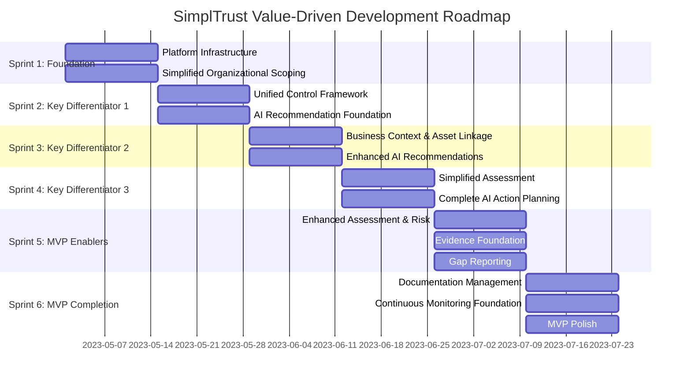

# SimplTrust: Agile Development Roadmap

## Executive Summary

SimplTrust is an AI-driven compliance and cybersecurity platform designed specifically for SMEs, simplifying complex regulatory and risk management challenges through guided workflows, automated gap analysis, and continuous monitoring. This roadmap integrates the requirements from Product, UX, and Technical stakeholders to define a prioritized feature set and development plan that balances business priorities, user experience excellence, and technical robustness.

The platform follows a Plan-Do-Check-Act (PDCA) cycle approach to continuous improvement, but our development prioritization is driven by **value delivery and hypothesis validation** rather than following the sequential PDCA flow.

## Value-Driven Approach

We've identified key differentiators that provide unique value to our target market:

1. **AI-Powered Guidance**: Converting complex compliance requirements into actionable tasks with minimal human expertise
2. **Unified Compliance Framework**: Eliminating redundant work across multiple regulatory frameworks
3. **Business-Centric Approach**: Linking compliance to business capabilities and assets for contextual relevance

Our roadmap is structured to deliver and validate these differentiators as early as possible, following lean startup principles. We build only the minimal necessary supporting functionality to enable our key value propositions.

## Epics and Feature Mapping

Our development is organized around epics that represent major value streams:

| Epic ID | Epic Name | Description | Features |
|---------|-----------|-------------|----------|
| E01 | Compliance Landscape Definition | Define regulatory landscape and map to business capabilities | ORG-001 |
| E02 | Unified Compliance Framework | Create consolidated control framework across regulations | UCF-001 |
| E03 | Asset Risk Management | Manage assets and determine security priorities | ASM-001, RSK-001 |
| E04 | Assessment & Gap Analysis | Evaluate compliance and identify gaps | ASP-001, GAP-001 |
| E05 | AI-Powered Action Planning | Generate actionable recommendations and tasks | ARP-001, IMP-001 |
| E06 | Documentation & Evidence | Maintain compliance documentation | EVD-001 |
| E07 | Continuous Compliance | Enable ongoing monitoring and improvement | CMN-001, TRN-001 |
| E08 | Integration & Extensibility | Connect with external systems and extend platform capabilities | INT-001 |
| E09 | Reporting | Generate comprehensive reports and dashboards for stakeholders | REP-001, REP-002, REP-003, REP-004 |

For complete epic definitions, see [Epics](./epics.md).

## Minimum Viable Product (MVP) Definition

The MVP for SimplTrust is designed to validate our key differentiators while providing immediate value. We focus on:

1. **Validating AI-Powered Guidance** (E05)
   - Developing simplified versions of upstream features to enable AI recommendations
   - Building the recommendation engine early to test with users

2. **Proving the Unified Framework Value** (E02)
   - Implementing control mapping and consolidation 
   - Showing tangible reduction in compliance overhead

3. **Demonstrating Business Context Value** (E01, E03)
   - Linking compliance to business capabilities and assets
   - Showing how this context improves decision-making

## Revised Sprint Plan

### Sprint 1 (2 weeks)
**Theme: Platform Foundation & Simplified Organizational Scoping**

**Key Deliverables:**
- Backend infrastructure setup (Supabase)
- User authentication system
- Basic frontend scaffolding with Next.js/TypeScript
- Simple organizational profile creation
- Basic regulatory applicability questionnaire
- Technical foundation for AI capabilities (API integration)

**Value Hypothesis Testing:**
- Validate that users can quickly identify applicable regulations without deep expertise
- Test assumption that SMEs struggle with regulatory identification

**Epic/Feature Focus:** E01 (ORG-001) with minimal implementation

### Sprint 2 (2 weeks)
**Theme: Unified Framework & AI Recommendation Foundation**

**Key Deliverables:**
- Control framework data model
- Basic unified control mapping for 2 key regulations
- Simplified dashboard showing consolidated controls
- AI recommendation engine foundation (basic algorithms)
- Initial recommendation generation for common controls

**Value Hypothesis Testing:**
- Validate that control consolidation provides tangible efficiency gains
- Test early AI recommendations to validate approach

**Epic/Feature Focus:** E02 (UCF-001), E05 (ARP-001 foundation)

### Sprint 3 (2 weeks)
**Theme: Business Context & Asset Linkage**

**Key Deliverables:**
- Basic asset inventory management
- Asset-to-control mapping
- Business capability-to-control relationship
- Asset criticality rating
- Enhanced AI recommendations based on business context

**Value Hypothesis Testing:**
- Validate that business context improves compliance decision-making
- Test assumption that asset criticality enhances prioritization

**Epic/Feature Focus:** E03 (ASM-001), E05 (ARP-001 enhancement)

### Sprint 4 (2 weeks)
**Theme: Simplified Assessment & AI-Powered Action Planning**

**Key Deliverables:**
- Simple assessment capability for selected controls
- Basic gap identification
- Full AI recommendation engine for identified gaps
- Task generation with prioritization
- Implementation tracking dashboard

**Value Hypothesis Testing:**
- Validate that AI recommendations save time and reduce expertise requirements
- Test assumption that automated task generation is valuable

**Epic/Feature Focus:** E04 (simplified ASP-001, GAP-001), E05 (ARP-001, IMP-001)

### Sprint 5 (2 weeks)
**Theme: Enhanced Assessment, Risk Management & Gap Reporting**

**Key Deliverables:**
- Enhanced assessment capabilities
- Complete gap analysis with visualization
- Gap reporting functionality
- Risk assessment linkage to assets
- Evidence collection foundation
- Improved AI recommendations based on risk
- Core reporting module foundation

**Value Hypothesis Testing:**
- Validate that risk-based prioritization improves decision-making
- Test assumption that evidence management is a pain point
- Evaluate if gap reporting provides sufficient visibility for stakeholders

**Epic/Feature Focus:** E04 (complete ASP-001, GAP-001, GAP-003), E03 (RSK-001), E06 (EVD-001 foundation), E09 (REP-001 foundation)

### Sprint 6 (2 weeks)
**Theme: Documentation & MVP Polish**

**Key Deliverables:**
- Evidence management system
- Basic training module framework
- Simple continuous monitoring capabilities
- Final user interface polish
- Bug fixes and performance improvements

**Value Hypothesis Testing:**
- Validate that documentation management provides audit readiness value
- Test assumption that continuous insights are important to users

**Epic/Feature Focus:** E06 (complete EVD-001, EVD-002, EVD-003), E07 (TRN-001, CMN-001 foundation)

## Post-MVP Roadmap

Our post-MVP development will be determined by the validated learning from our MVP, focusing on:

1. **Enhancing validated differentiators** - Building on what users find most valuable
2. **Addressing identified gaps** - Resolving limitations discovered during MVP usage
3. **Expanding to adjacent value streams** - Adding capabilities that complement core value

Initial directions may include:

### Phase 1: Differentiator Enhancement (3 months)
- Advanced AI recommendation algorithms
- Expanded control mapping across more regulations
- Enhanced business context integration
- Implementation metrics and advanced reporting capabilities

### Phase 2: Integration Ecosystem (3 months)
- Integration with security tools
- API for embedding in existing workflows
- Expanded document and evidence management
- Executive dashboards and external reporting

### Phase 3: Enterprise Expansion (6 months)
- Multi-entity management
- Advanced analytics and benchmarking
- Customizable workflows
- Compliance automation

## Success Metrics & Learning Plan

### MVP Success Metrics
- **Differentiator Validation**: Qualitative feedback on key differentiators
- **Time Savings**: 30%+ reduction in time spent on compliance activities
- **Expertise Reduction**: Ability for non-experts to perform compliance tasks
- **User Adoption**: 10+ SMEs actively using the platform
- **NPS**: Score of 30+ with specific feedback on differentiators

### Learning Plan
1. **User Interviews** (Bi-weekly)
   - Structured interviews to gather feedback on differentiators
   - Observation of user interactions with key features

2. **Usage Analytics** (Continuous)
   - Feature usage tracking
   - Time spent on different activities
   - Conversion rates and drop-off points

3. **A/B Testing** (When possible)
   - Testing variations of AI recommendations
   - Testing different visualization approaches

4. **Feedback Loops** (Weekly)
   - In-app feedback mechanisms
   - Regular check-ins with early adopters

## Visual Roadmap

## Conclusion

This agile roadmap provides a clear path to develop the SimplTrust platform following lean startup principles, focusing on validating our key differentiators early. By prioritizing features based on customer value rather than logical platform flow, we maximize learning opportunities and ensure we're building a product that meets real market needs.

Our approach enables rapid validation of core value hypotheses while minimizing waste from building unvalidated features. The MVP is designed to deliver immediate value to users while providing us with the insights needed to guide future development priorities. 